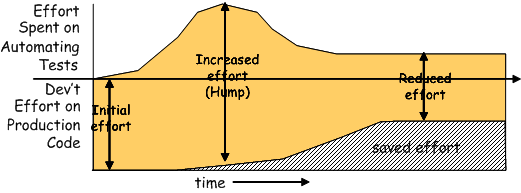
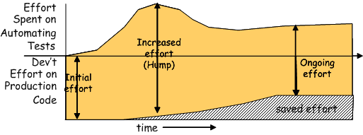
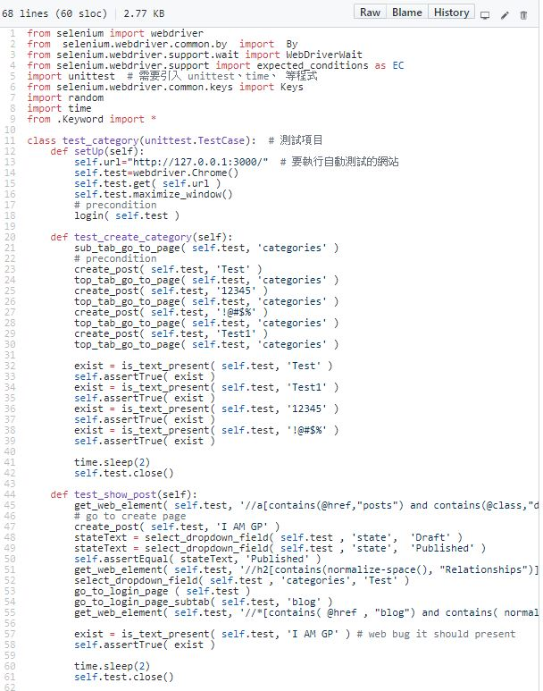

# Goals of Test Automation
## Why Test?
寫測試很難了，寫`好測試`更難

有些人覺得測試難寫難維護，覺得成本會提高進而放棄 

本篇就是要介紹作者如何解決測試困難。 

他也列出下列兩要點: 
1. 要實現的目標 
2. 實現目標的方法 

## Economics of Test Automation
觀察以下兩張圖 

駝峰: 為了測試自動化，去學習新技術以及實踐它所帶來的成本增加。 

`Economics-Good` 

 

好的測試在爬過駝峰後，開發成本會趨於穩定，測試自動化增加的成本會和減少手動測試

以及測試自動化盡早發現問題，帶來的好處做抵銷，達到不費力卻有效益。 

`Economics-Bad` 

 

不好的測試難維護無法發揮效益，造成工作量持續增加，成本日益提高， 

最後可能會放棄測試自動化。

## Goals of Test Automation
+ Tests should help us improve quality. (測試要能改善品質)
+ Tests should help us undertand the system under test (SUT). (測試要能使我們更了解待測程式)
+ Tests should reduce (and not introduce) risk. (測試要能降低風險)
+ Tests should be easy to run.(測試要容易執行)
+ Tests should be easy to write and maintain. (測試要容易寫及容易維護)
+ Tests should require minimal maintenance as the system evolves around them. 
(在系統改變時測試只需做小改動) 

    前三個Focus在`測試提供的價值`，後三個Focus在`測試本身特點`

___
## Tests should help us improve quality
`Goal: Tests as Specification`<br\>
如果開發模式是test-driven development or test-first development，我們會實作前先去確認待測程式它應該有的行為，<br\>這樣有助於釐清需求，找模糊或矛盾的部分，進而提高Code品質。

test-driven vs test-first: 都是實作Production Code前先有測試案例，不同點在於test-driven，一次只專注於一個測試，有點像單點切入，不開多個戰場，而test-first並沒有此限制。

`Goal: Bug Repellent`<br\>
簡言之測試能協助我們De Bug，假使我們有regression test之後，讓我們敢改Code，能改Code，我們可以去確保自己新加的Code，沒有影響到先前的功能運作。

`Goal: Defect Localization`<br\>
簡言之單元測試可以讓我們知道程式為什麼不Work，明確指出原因以及有缺陷的部分。

## Tests should help us understand the SUT
`Goal: Tests as Documentation`<br\>
簡言之看測試一定比看待測物Source Code來的快並且更明確，知道錯哪減少去猜Bug點，因為我們知道待測程式的行為，所以按照Test Step 一步一步去Trace即可，這樣也能我們更了解待測程式應該有的行為。
## Tests should reduce (and not introduce) risk
    測試應該是降低風險而不是製造風險  
`Goal: Tests as Safety Net`<br\>
簡言之測試就是一張安全網，當我們有regression test，就不怕改壞，壞了再經由版本控制或IDE內建回復即可，測試使我們敢改能改，不留技術債。

例如:
+ 遇到一段遺留Code我們敢刪 
+ 我們敢refactory code不是每次遇到新需求就新寫function，勇於擴充function 

`Goal: Do No Harm` <br\>
Also known as: No Test Risk<br\>
簡言之測試Code就在測試做，不要把測試邏輯埋進Production Code，
不要為了測SUT而去修改SUT。

## Tests should be easy to run
    測試要容易Run有以下四個具體目標
    1. Fully Automated Tests
    2. Self-Checking Tests
    3. Repeatable Tests
    4. Independent Test

`Goal: Fully Automated Test`<br\>
簡言之全自動化測試，不加入人工去干涉它。

`Goal: Self-Checking Tests`<br\>
簡言之有辦法確認Test是通過還是失敗，對應到專案上，我們測試會加上Post condiction 去確認目前程式行為正確，通過就是Pass然後是綠色的，Fail則會是紅色，並可以確認錯在哪個步驟 

>>`PASS`
 
>>`FAIL`
 
>>`FAIL 原因`
 

`Goal: Repeatable Test`<br\>
簡言之測試可以重複執行 
要能重複執行需要滿足下面2項條件 
1. 測試獨立性
2. Automated Teardown  
在專案上我們測試都會是獨立的，不依賴其他TestCase，也會寫Teardown確保腳本可重複執行。

## Tests should be easy to write and maintain
    測試要簡單易讀，測試重疊性要低，這樣才好寫好維護，不會系統一更動，測試要全部打掉重來。
    測試太複雜原因:
    1. 一個測試要測太多功能
    2. 測試跨太多scope，步驟太複雜

    若之後某部分更動了，這樣要改的地方增加，非主要測試目的造成的錯誤我也要維護，這樣會增加維護困難性。

`Goal: Simple Tests`<br\>
簡言之一次測試，測一件事不要開太多戰場，這樣測試失敗時，就知道錯的點在哪。

`Goal: Expressive Tests`<br\>
簡言之可以提高Test method的高度，不要讓method的細節散落在測試當中，這樣一來未來系統更動，只要更改某個method而不是更改散落於不同測試的細節。

下圖為例:

 

`Goal: Separation of Concerns`<br\>
簡言之測試關注點要分開，一次就關注一件事，不要一次測試太多，這樣會模糊焦點。

下圖為例:

 

## Tests should require minimal maintenance as the system evolves around them

`Goal: Robust Test`<br\>
簡言之要達到穩健測試，就要最小化測試重疊的部分，為何要這樣? 
因為這可以使我們避免掉系統更動須改大量測試的窘境，因為測試切得夠乾淨，這樣得測試失敗的原因更容易找，測試需要維護的點更加明確，更不容易因為其他原因產生Fail。
