# AngularJS services

## 說明
我們現在的專案是開發網頁，並採用AngularJS框架進行開發。而在開發時，我們很常會需要用到各種不同的services，所以這裡就來介紹一下AngularJS的service。


這張圖片就是我們網頁大概的樣子

`Connector Library page`

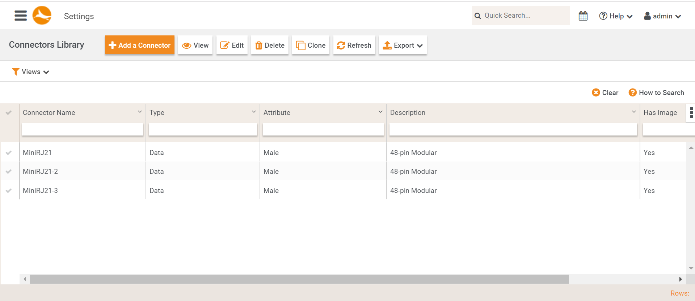

我們的網頁通常都是一個html配上一個controller

`html and controller`

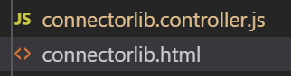

在controller裡面我們就會使用到很多service
```js
function ConnectorLibController($scope, connectorToolBarService, gridHelperService, $timeout, connectorLibDataService, screenService, SCREEN_MODE
   , connectorLibService, dialogService, DCT_CONNECTOR_MENU_ACTION, $rootScope){
```

那這些service是從哪裡來的呢?在module的地方AngularJS使用了Dependency Injection的方法。

`connectorlib.module.js`
```js
import uiRouter from 'angular-ui-router';
import routeConfigConnectorLib from './connectorlib.state';
import connectorToolBarService from './connector-toolbar.service';
import connectorLibDataService from './connectorlib-data.service';
import connectorLibService from './connectorlib.service';
import ConnectorLibController from './connectorlib.controller';

let ConnectorLibModule = angular.module('app.connectorlib', [
    uiRouter,
    'app',
    'app.components'
]);

ConnectorLibModule.config(routeConfigConnectorLib, [uiRouter])
        .factory('connectorToolBarService', connectorToolBarService)
        .factory('connectorLibDataService', connectorLibDataService)
        .factory('connectorLibService', connectorLibService)
        .controller('app.connectorlib.ConnectorLibController', ConnectorLibController)

export default ConnectorLibModule;

```

比如說 `.factory('connectorToolBarService', connectorToolBarService)`
第二個參數是我們想要inject的service，第一個參數則是我們可以在controller可以使用的名稱


## Dependency Injection
這邊來解釋一下什麼是Dependency Injection，首先先說明什麼是Dependency。比如說，A class有使用到B class，那就是A對於B有Dependency(相依性)，也可以說A depend on B。

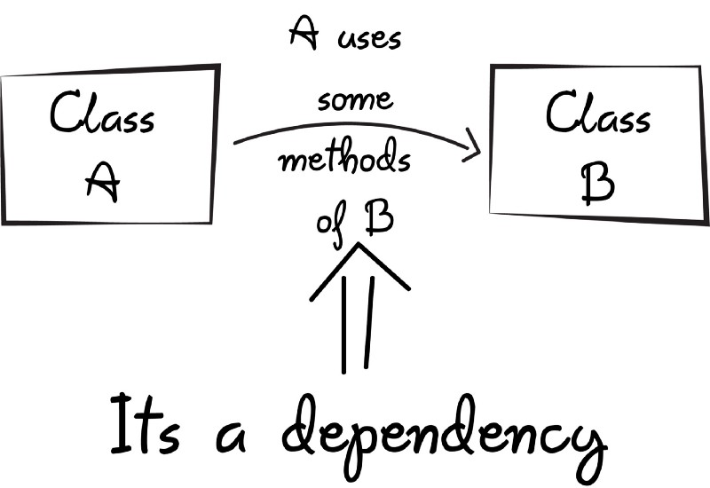
圖片參考來源(https://www.freecodecamp.org/news/a-quick-intro-to-dependency-injection-what-it-is-and-when-to-use-it-7578c84fa88f/)


一個class如果depend on 太多class，會造成可維護性降低。
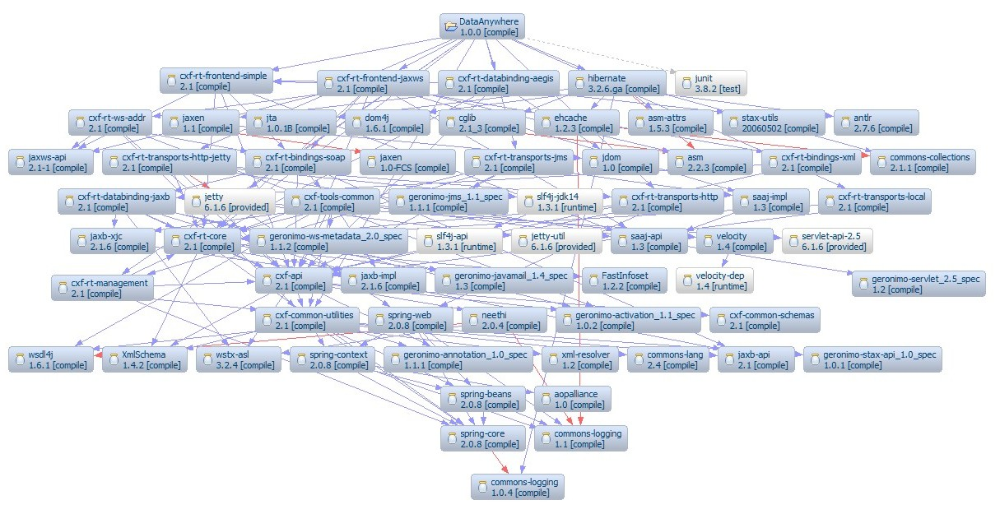
圖片參考來源(http://sheelapps.com/index.php?p=Blog.Maven_To_Save&action=view)

為了要降低dependency，Martin Fowler就提出了Dependency Injection的方法。

我在這邊舉個例子解釋Dependency Injection，這個例子是有一個漢堡(Hamburger)，漢堡的漢堡排是牛肉(Beef)，然後我可以從漢堡知道總熱量

```cpp
class Hamburger{
public:
  Hamburger(){}

  int getTotalCalorie(){
    return _breadCalorie + _beef->getCalorie();
  }

private:
  int _breadCalorie = 290;
  Beef * _beef = new Beef();
};

class Beef{
public:
  Beef(){}

  int getCalorie(){
    return _calorie;
  }

private:
  int _calorie = 190;
};
```


`牛肉寫在漢堡裡的Dependency`

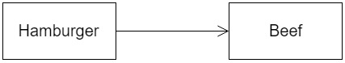

現在我是把牛肉寫死在private裡面(Hamburger是depend on Beef)，但是如果我想要換成豬肉漢堡排，我的漢堡就得要改。

```cpp
class Hamburger{
public:
  Hamburger(){}

  int getTotalCalorie(){
    return _breadCalorie + _pork->getCalorie();
  }

private:
  int _breadCalorie = 290;
  Pork * _pork = new Pork();
};

class Pork{
public:
  Pork(){}

  int getCalorie(){
    return _calorie;
  }

private:
  int _calorie = 150;
};
```

所以在這裡我們就可以使用Dependency Injection的方法來解決這個問題。首先因為不管是牛肉還是豬肉漢堡排，我們都要取得漢堡排的卡路里，所以我們可以為漢堡排(Patties)定一個介面，然後牛肉和豬肉去實作它。

```cpp
class Patties{
public:
    Patties(){}
    virtual int getCalorie() = 0;
};

class Beef : public Patties{
public:
    Beef(){}

    int getCalorie(){
        return _calorie;
    }

private:
    int _calorie = 190;
};

class Pork : public Patties{
public:
    Pork(){}

    int getCalorie(){
        return _calorie;
    }

private:
    int _calorie = 150;
};
```

再來因為是由員工去作出漢堡的，透過員工來把牛肉或豬肉和漢堡包組合在一起，所以我們也可以再多訂一個員工(Staff)的物件，然後在這裡使用Dependency Injection。

```cpp
class Hamburger{
public:
    Hamburger(Patties * staffDecidePatties){
        _patties = staffDecidePatties;
    }

    int getTotalCalorie(){
        return _breadCalorie + _patties->getCalorie();
    }

private:
    int _breadCalorie = 290;
    Patties * _patties;
};


class Staff{
public:
    Staff(){}
    Hamburger makeBeefHamburger(){
        Patties * beef = new Beef();
        Hamburger * hamburger = new Hamburger(beef);
        return hamburger;
    }
    Hamburger makePorkHamburger(){
        Patties * pork = new Pork();
        Hamburger * hamburger = new Hamburger(pork);
        return hamburger;
    }
};
```


`使用Dependency Injection之後`


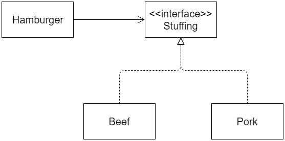


`完整的Dependency`

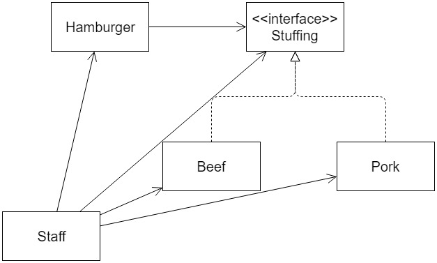


如此一來Hamburger就只depend on介面Patties，所以不管實作的漢堡排變成甚麼，Hamburger都不用改。


## Creating services
回到主題，剛剛在前面我們看到了`factory()`，這個是AngularJS提供用來建立service的一個方法，AngularJS提供了幾種方法來建立這些service，這裡我講解兩個主要的方法
`factory()`和`provider()`


## factory()
首先先從factory()開始，這個是在AngularJS裡面最常被用來建立service的方法。

假設我們今天要加入一個toolbar的功能

`connector toolbar圖片`

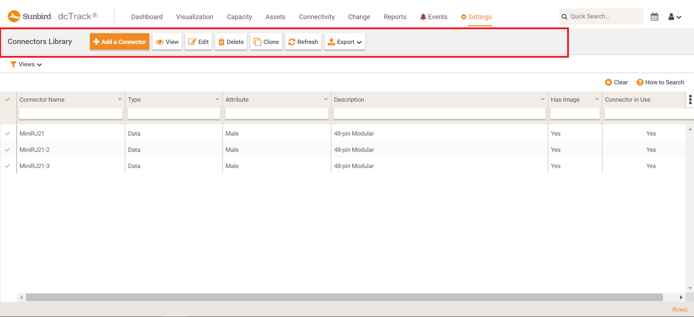

為了加入這個功能，我們就為這個功能寫一個service，我們把它命名為connectorToolBarService，於是在module裡面我們定義了一行
`.factory('connectorToolBarService', connectorToolBarService)`

雖然左右兩個參數看起來名字一樣，但其實第一個參數就是AngularJS會幫你建立的instance，第二個參數則是你打算inject的service。

`.factory(名稱, function(){});`

如果只是簡單的service，也可以把程式碼直接寫在第二個參數裡面，但是我們的程式會比較複雜一點，所以我們寫在另外一個檔案，再把它放進來。

我們先來看一下第二個參數，就是定義service，用factory()建立的service裡面要return一個object, object裡面放你要提供的function。

就像下面的例子，我們直接把object的名稱宣告叫service，然後object裡面放了很多關於toolbar的相關function。

`connector-toolbar.service.js`

```js
function connectorToolBarService(DCT_CONNECTOR_MENU_ACTION, DCT_MENU_ACTION){ 
    'ngInject';

    var service = {
        getToolBarData: getToolBarData,
        getToolBarDataDisabled: getToolBarDataDisabled,
        getListFilterToolBarData: getListFilterToolBarData,
        getDetailToolBarData: getDetailToolBarData,
        getCordsOrAdapterToolBarData: getCordsOrAdapterToolBarData,
        getCompatibilityWithConnectorToolBarData: getCompatibilityWithConnectorToolBarData,

        getMenuStatus: getMenuStatus,
        getDetailMenuStatus: getDetailMenuStatus,
        getCompatibilityMenuStatus: getCompatibilityMenuStatus,
        getCordsOrAdapterMenuStatus: getCordsOrAdapterMenuStatus
    };
    return service;

    function getToolBarData(scope, menuName){
        var data =  {id: menuName, disabled: false, active: true, items: []};

        if(menuName === 'connectorList'){
          data.class = 'dct-toolbar dct-sub-nav';
        }

        data.items.push({
          id: DCT_MENU_ACTION.TAB_NAME,
          type: 'pageTitle',
          value: 'Connectors Library',
          disabled: false
        });

        data.items.push({
          id: DCT_MENU_ACTION.NEW,
          class: 'dct-btn-prime',
          icon: 'fa fa-plus fa-lg',
          label: 'Add a Connector',
          disabled: false,
          action: scope.newMenuClicked
        });

        data.items.push({
          id: DCT_MENU_ACTION.VIEW,
          icon: 'fa fa-eye fa-lg',
          label: 'View',
          disabled: false,
          action: scope.viewMenuClicked
        });

        data.items.push({
          id: DCT_MENU_ACTION.EDIT,
          icon: 'fa fa-edit fa-lg',
          label: 'Edit',
          disabled: true,
          action: scope.editMenuClicked
        });

        data.items.push({
          id: DCT_MENU_ACTION.DELETE,
          icon: 'fa fa-trash fa-lg',
          label: 'Delete',
          disabled: true,
          action: scope.testMenuClick
        });
        
        data.items.push({
          id: DCT_CONNECTOR_MENU_ACTION.CLONE,
          icon: 'fa fa-clone fa-lg',
          label: 'Clone',
          disabled: true,
          action: scope.testMenuClick
        });

        data.items.push({
          id: DCT_MENU_ACTION.REFRESH,
          icon: 'fa fa-refresh fa-lg',
          label: 'Refresh',
          disabled: false,
          action: scope.testMenuClick
        });

        addExportMenuForConnector(scope, data, menuName);

        _.each(data.items, function(rec){
          rec["event"] = menuName;
          rec["disabled"] = false;
        });

        return data;
    }

.
.
.
.
export default connectorToolBarService;
```

以getToolBarData這個function為例，我們為toolbar定義了各種按鈕和按鈕的圖案等等的設定。

`.factory('connectorToolBarService', connectorToolBarService)`

然後我們再來看看第一個參數，當我們在AngularJS裡面使用service，就是要用第一個參數的名字，所以現在我們要在controller裡面使用這個service的話，我們就要把第一個參數的名字放進controller內。

function ConnectorLibController($scope, `connectorToolBarService`, gridHelperService, $timeout, connectorLibDataService, screenService, SCREEN_MODE
   , connectorLibService, dialogService, DCT_CONNECTOR_MENU_ACTION, $rootScope){

之後我們就可以使用這個service了

```js
$scope.connectorLibTbData = connectorToolBarService.getToolBarData($scope, 'connectorList');
```

`connector toolbar放大圖片`

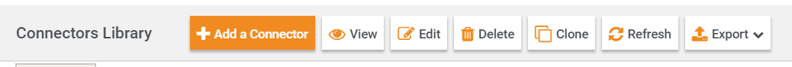


## provider()
再來我要講解的是provider，provider可以讓你對service進行一些設定，特別適合用在第三方套件，比如說像i18n，我們就是使用angular-translate這個套件。

AngularJS用provider()建立service的寫法和factory()一樣

`.provider(名稱, function(){});`

第二個參數service的定義一樣可以直接寫在裡面或寫在其他地方，第一個參數一樣是使用時的instance。而提供服務的function則是要寫在`this.$get`裡面，然後和factory()一樣裡面是要return一個object。

像在angular-translate的套件裡面，他就是用provider去建立service的。

`angular-translate.js`
```js
angular.module('pascalprecht.translate')
  .constant('pascalprechtTranslateOverrider', {})
  .provider('$translate', $translate);

function $translate($STORAGE_KEY, $windowProvider, $translateSanitizationProvider, pascalprechtTranslateOverrider) {
```

然後$translate裡面寫了`this.$get`，然後透過區域變數$translate這個object裡面放function來定義要提供那些服務，因為原始碼很大，所以我在這邊只放上部分的code。像這裡就把`instant`的function放進$translate，最後再return這個object。

```js
this.$get = ['$log', '$injector', '$rootScope', '$q', function ($log, $injector, $rootScope, $q) {
    var $translate = ...
    .
    .
    .
    $translate.instant = function (translationId, interpolateParams, interpolationId, forceLanguage, sanitizeStrategy) {
    .
    .
    }
    .
    .
    return $translate;
}];
```

於是我們才可以使用`instant`這個功能，舉例來說，我們想要翻譯footer。

`Item footer`

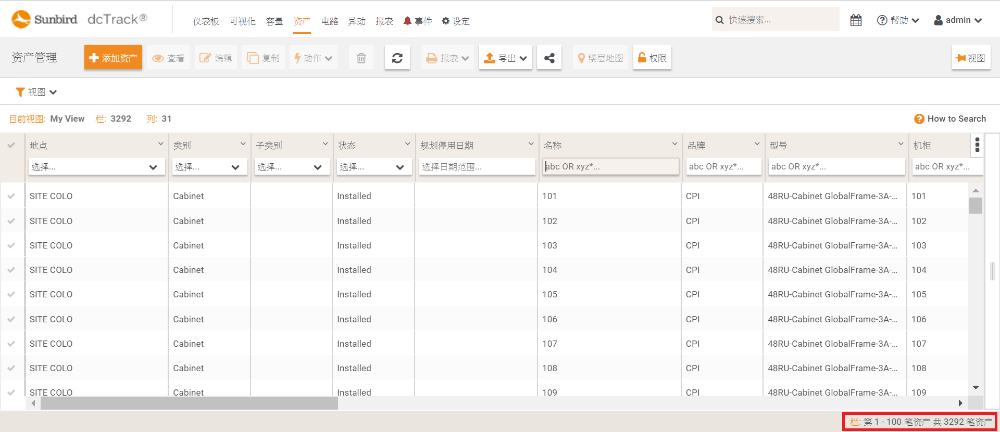

`items-list.service.js`
```js
scope.recordsReportHtmlString = $translate.instant("ASSETS.ITEMLIST.FOOTER_RECORDS_REPORT").replace(/{%0}/, rows).replace(/{%1}/, data.totalRows);
```

使用$translate.instant之後，它就可以在runtime的時候幫我們把footer翻成想要的語言。

`Item footer`


那要怎麼對service進行設定呢?AngularJS用`config()`來對service做設定。

```js
.config(function(服務名稱+Provider){
  服務名稱+Provider.可以設定的函數(參數);
})
```

可以設定的函數，是在service裡面就寫好未來會提供別人設定的function。

`config()`裡面只能放`服務名稱+Provider`，不能放其他service，比如說connectorToolBarService；而`服務名稱+Provider`也只能放在`config()`裡面，不能放進controller之類的。

這邊舉個我們對angular-translate的套件去做設定的例子，

我們在`app.js`(主要的module)裡面會加入這一行，因為我們要設定的東西蠻多的，所以我們也寫在其他地方，然後再傳進來。
```js
.config(translate)
```

下面這個就是我們用`服務名稱+Provider`去做設定的，所以我們要使用的service是`$translate`，加上`Provider`之後，就變成了`$translateProvider`。$translateProvider.preferredLanguage('en-US')，以這行來說，我們就是把偏好語言設成英文。

`app.translate.js`
```js
'use strict';

translate.$inject = ['$translateProvider', '$translatePartialLoaderProvider'];

function translate($translateProvider, $translatePartialLoaderProvider) {
    $translateProvider.useSanitizeValueStrategy('escapeParameters');
    $translateProvider.useLoader('$translatePartialLoader', {
        urlTemplate: 'scripts/static/i18n/{part}-{lang}.json'
    });
    // $translateProvider.fallbackLanguage('en-US');
    if (sessionStorage.getItem('i18n_lang')) {
        var lang = sessionStorage.getItem('i18n_lang');
        $translateProvider.preferredLanguage(lang);
    } else {
        $translateProvider.preferredLanguage('en-US');
        sessionStorage.setItem('i18n_lang', 'en-US');
    }
    $translateProvider.fallbackLanguage('en-US');
    $translatePartialLoaderProvider.addPart('common');
}
export default translate
```

## Singleton
最後來提一下Singleton，很多AngularJS文章或官網都說AngularJS的service是Singleton。

`AngularJS官網`

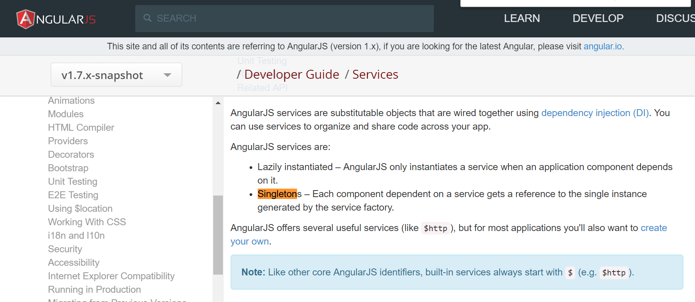

但是這裡和Singleton Pattern有些不一樣，因為Singleton Pattern是只會存在一個instance，不會有第二個，就算重新new一個，也是會存取到同一個instance。

AngularJS說的Singleton指的是AngularJS建立的service instance在不同的controller之間是會被共用的，也就是說那些controller用到的service是同一個。但是AngularJS是可以創造多個instance的。


舉例來說，我今天有一個connectorToolBarService，我可以創造一個叫connectorToolBarService_first，然後我又可以再創造另外一個叫connectorToolBarService_second，這兩個都是connectorToolBarService的instance。所以不是只能有一個instance
```js
.factory('connectorToolBarService_first', connectorToolBarService)
.factory('connectorToolBarService_second', connectorToolBarService)
```

`更新`
教授說這個就是`Singleton by name`，所以還是Singleton pattern，一個名字只能有一個instance。


## Conclusion
寫service的好處是可以reuse，但是要注意Singleton這個特性，如果兩個controller都是用同一個service的instance，那麼其中一個controller改動了service裡面其中一個變數，另外一個controller也會被影響。


## reference
reference book: professional angularjs

https://docs.angularjs.org/guide/services

https://joelhooks.com/blog/2013/05/01/when-is-a-singleton-not-a-singleton


