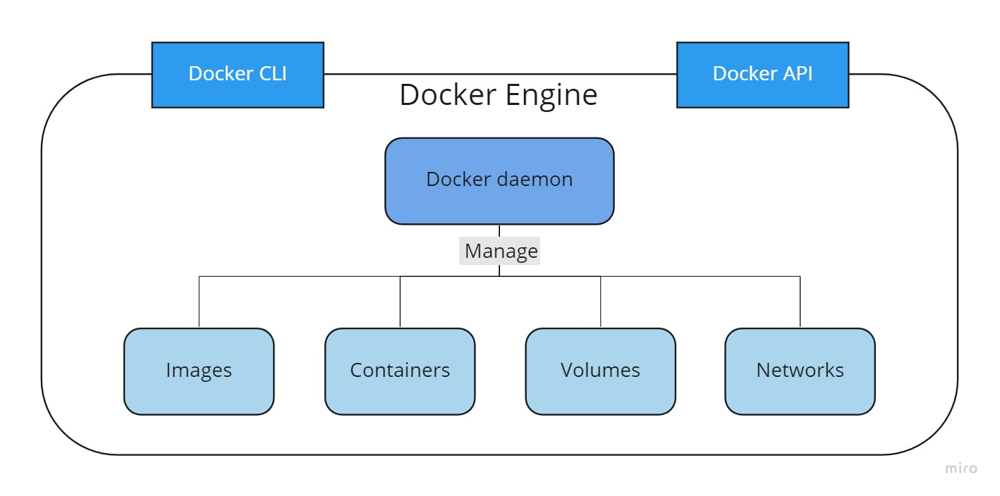
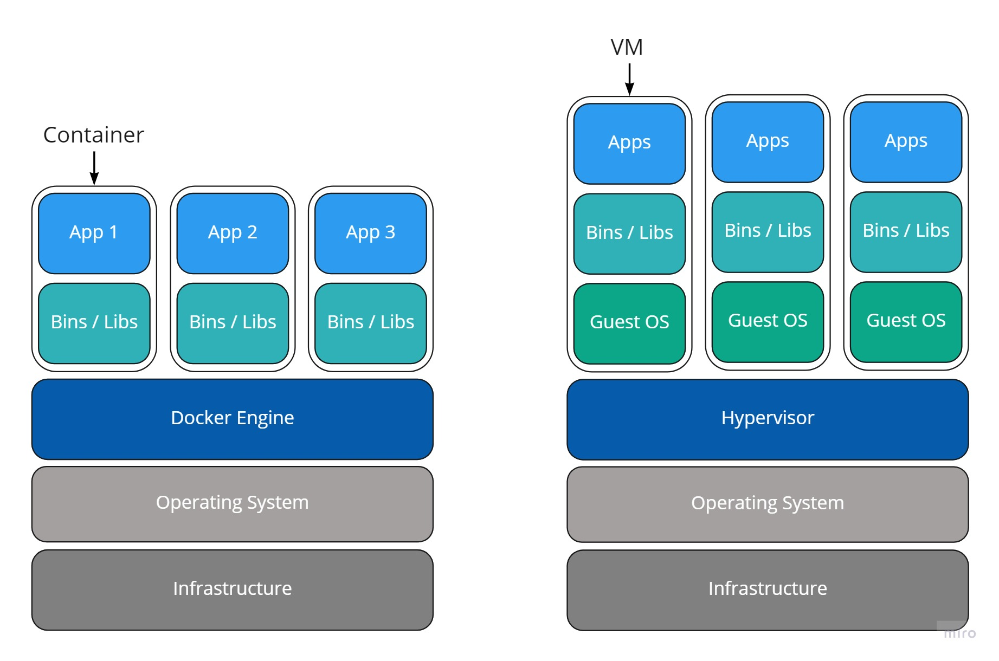
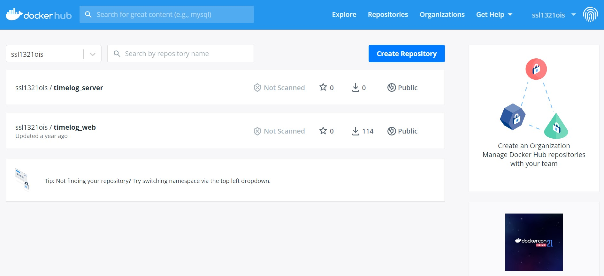
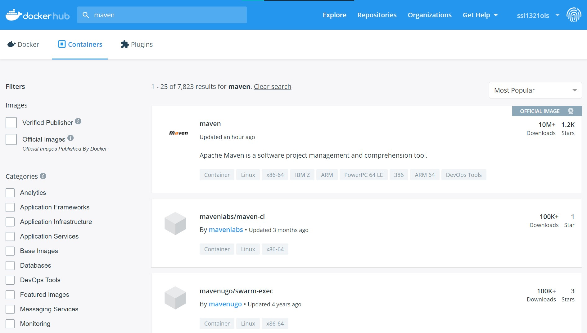
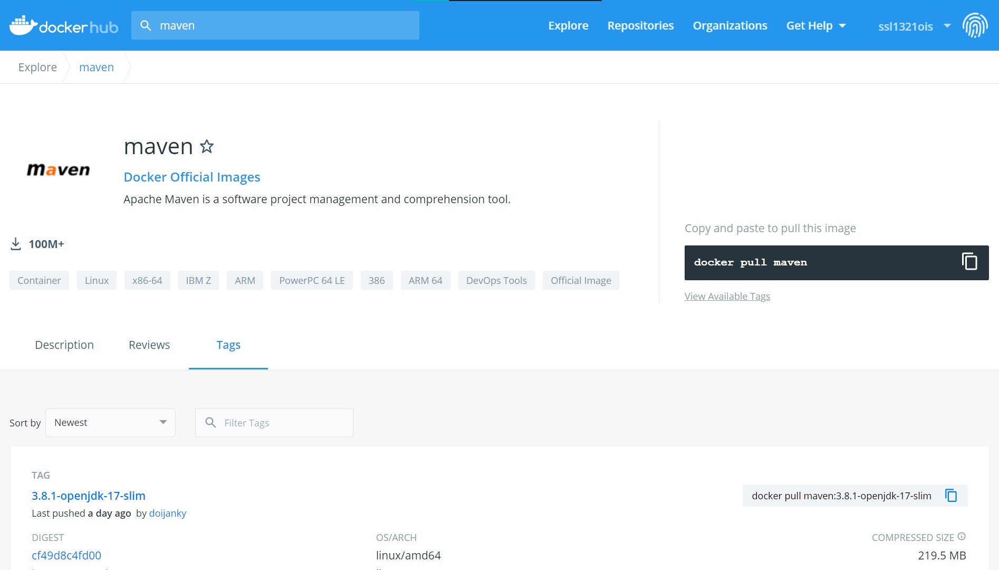
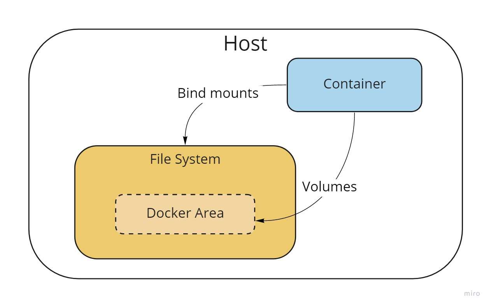

# Docker Introduction
[](img/docker_logo.png)

## Agenda
- [Overview](#overview)
- [Docker Engine](#docker-engine)
- [Docker Container](#docker-container)
- [Docker Image](#docker-image)
- [Common Docker CLI](#common-docker-cli)
- [Docker Storage](#docker-storage)
- [Docker Architecture](#docker-architecture)
- [Reference](#reference)

## Overview
Docker is a platform for developers to develop, ship and run applications in containers.<br>
Developers can build an image from a `Dockerfile`, and the image becomes a container when it runs on `Docker Engine`.

## Docker Engine
Docker Engine is a technology for building and containerizing applications.<br>
Docker Engine is composed of a long-running daemon process, API and CLI.<br>


## Docker Container
A container contains the essential resources to run an application, and it packages application code, its dependencies, its libraries, and so on.<br>
Therefore, the application runs quickly and reliably from one computing environment to another.<br>
Containers share the OS system kernel of the machine, in other words, they don't need an OS per application.<br>
A Docker container is as an isolated process on `Docker Engine`.

### Docker Container v.s. Virtual Machine
Both of Docker container and virtual machine can isolate the resources.<br>
Virtual machine runs its own OS and simulates the hardware.<br>
Docker Container is lightweight, portable and easy to deploy.


## Docker image
A Docker image is a read-only template with instructions for creating a Docker container.<br>
To build an image, we need to make a `Dockerfile`.

### Common Dockerfile instructions
`Dockerfile` Example:
``` docker
FROM maven:3.6.3-jdk-11
ADD . /app
WORKDIR /app

# Run spring-boot server
CMD ["mvn", "spring-boot:run"]
```

`FROM` instruction: to use current official images as the basis for an image.
``` docker
FROM [--platform=<platform>] <image> [AS <name>] // default: latest version
FROM [--platform=<platform>] <image>[:<tag>] [AS <name>]
FROM [--platform=<platform>] <image>[@<digest>] [AS <name>]
```

`RUN` instruction: to execute a command and to commit the result.
``` docker
RUN <command>                            // shell form
RUN ["executable", "param1", "param2"]   // exec form
```

`CMD` instruction: to run the software contained in an image.<br>
*There can only be one `CMD` instruction in a Dockerfile, or the container would execute the last command.*
``` docker
CMD ["executable","param1","param2"]
CMD ["param1","param2"]
CMD command param1 param2
```

`EXPOSE` instruction: to indicate the ports on which a container listens for connections.
``` docker
EXPOSE <port> [<port>/<protocol>...]
```

`ENV` instruction: to set the environment variables.
``` docker
ENV <key>=<value> ...
```

`ADD` instruction: to add new files or directories from source to destination.<br>
*features: local-only tar extraction and remote URL support*
``` docker
ADD [--chown=<user>:<group>] <src>... <dest>
ADD [--chown=<user>:<group>] ["<src>",... "<dest>"]
```

`COPY` instruction: to copy files or directories from source to destination.
``` docker
COPY [--chown=<user>:<group>] <src>... <dest>
COPY [--chown=<user>:<group>] ["<src>",... "<dest>"]
```

`WORKDIR` instruction: to set the working directory.<br>
*If the working directory doesn't exist, it will be created.*
``` docker
WORKDIR /path/to/workdir
```

`ARG` instruction: to define a argument.
```
ARG <name>[=<default value>]
```

### Docker Registry
A Docker registry stores Docker images.

### Docker Hub
`Docker Hub` is a public registry managed by Docker, Inc. <br>
It centralizes information about organizations, user accounts, and images.<br>
Developers can find and share the container images.<br>




## Common Docker CLI
To pull an image or a repository from a registry.
``` shell
$ docker pull [OPTIONS] [REGISTRY_HOST/]NAME[:TAG|@DIGEST]
OPTIONS: --all-tags(-a), ...
```

To run an image.
``` shell
$ docker run [OPTIONS] IMAGE [COMMAND] [ARG...]
OPTIONS: --env(-e), --interactive(-i), --name, --publish(-p), --workdir(-w), ...
```

To list containers.
``` shell
$ docker ps [OPTIONS]
OPTIONS: --all(-a), --filter(-f), --no-trunc, ...
```

To run a command in a running container.
``` shell
$ docker exec [OPTIONS] CONTAINER COMMAND [ARG...]
OPTIONS: --env(-e), --interactive(-i), --workdir(-w), ...
```

To start one or more stopped containers.
``` shell
$ docker start [OPTIONS] CONTAINER [CONTAINER...]
OPTIONS: --interactive(-i), ...
```

To stop one or more running containers.
``` shell
$ docker stop [OPTIONS] CONTAINER [CONTAINER...]
OPTIONS: --time(-t)
```

To kill one or more running containers.
``` shell
$ docker kill [OPTIONS] CONTAINER [CONTAINER...]
OPTIONS: --signal(-s)
```

To create a new image from a container’s changes.
``` shell
$ docker commit [OPTIONS] CONTAINER [REPOSITORY[:TAG]]
OPTIONS: --change(-c), ...
```

To push an image or a repository to a registry.
``` shell
$ docker image push [OPTIONS] [REGISTRY_HOST/]NAME[:TAG]
OPTIONS: --all-tags(-a), ...
```

## Docker Storage
By default all files created inside a container are stored on a writable container layer so that the data doesn’t persist when that container no longer exists.<br>
Docker has two options for containers to store files in the host machine: volumes, and bind mounts.<br>
`Volumes` are stored in a part of the host filesystem which is managed by Docker. Non-Docker processes should not modify this part of the filesystem.<br>
`Bind mounts` may be stored anywhere on the host system. They may even be important system files or directories. Non-Docker processes on the Docker host or a Docker container can modify them at any time.<br>
[](img/docker_storage.jpg)

## Docker Architecture
[](img/docker_architecture.png)<br>
Refer to: https://www.aquasec.com/cloud-native-academy/docker-container/docker-architecture/


## References
[Container](https://www.docker.com/resources/what-container)

[Docker Docs](https://docs.docker.com/get-started/overview/)

[Docker Architecture](https://www.aquasec.com/cloud-native-academy/docker-container/docker-architecture/)