# 雙碼注音
我設計一個基於注音符號的、新的中文輸入法

## 背景知識：雙拼音
### 原理
|                 | 雙      | 拼   |
|-----------------|--------|-----|
| 注音              | ㄕㄨㄤ    | ㄆㄧㄣ |
| 漢語拼音            | ŝuāŋ   | pīn |
| 漢語拼音（相容電腦，省略音調） | shuang | pin |
| 自然碼             | ud     | pn  |

u = sh
d = uang

p = p
n = in

基本輸入原理同現行的盲人點字

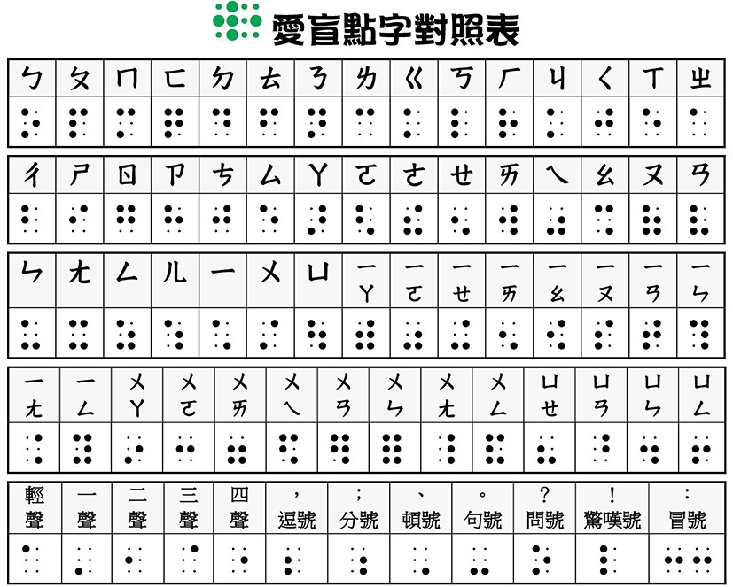

###  雙拼的優點
- 能英文盲打就能中文盲打，且有類似的輸入體驗
- 輸入法不佔用數字鍵、標點符號，數字、標點符號都可以直接輸入
- 主要輸入按鍵只佔用上、中、下三排，25 ~ 27 個按鍵輸入中文
    - 手機上也**不容易誤按**（按鍵少，單一按鍵面積大）
- 中文、外文混合輸入，過程中不需切換輸入法
- 不需要學習或記憶太多背景知識，儘快開始練習
    - 倉頡還要額外學習如何拆字 
- 聲調可以省略，兩個按鍵決定一個音，固定長度的編碼
	- 若依照字詞頻率、手指指法，設計鍵盤佈局。使用者能有流暢的、有節奏的打字體驗
- 若不省略聲調，減少選字
- 因為聲調可以省略，不像微軟注音，需要完整輸入一個字才能輸入下個字
	- 只要沒有按下聲調，輸入法會認為使用者**正在修正按鍵** 

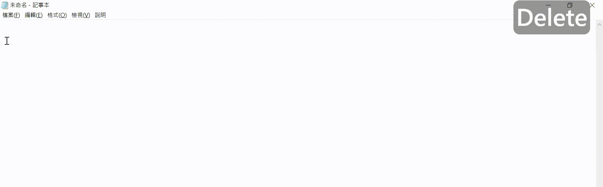

- 主流電腦系統、手機系統都有內建
	- Windows 系統只有簡體中文有內建雙拼輸入法，有三個方案可以選擇。
	- iOS 則是不論簡體中文、繁體中文都有內建雙拼， 有四個方案可以選擇。
	
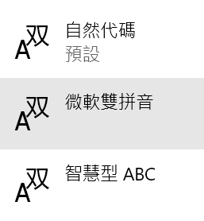
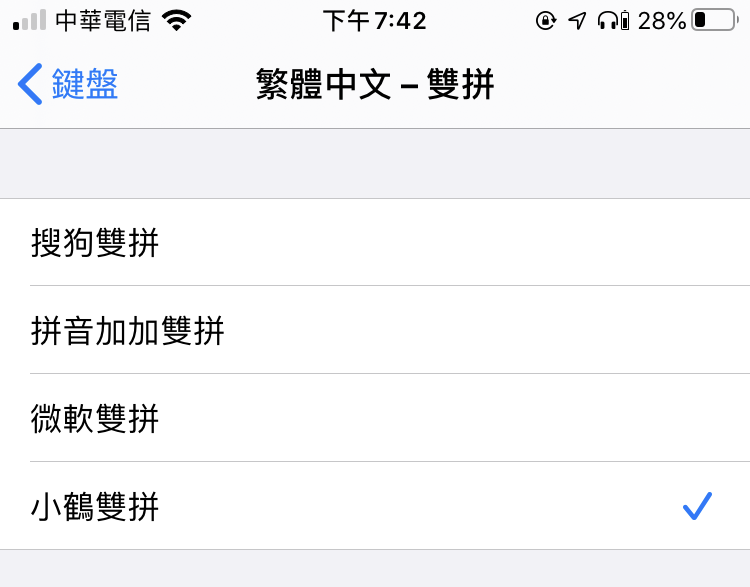

###  雙拼音的問題
- 基於漢語拼音設計，而不是注音，部分規則不相同
- 我使用輸入法的時候，必須先在腦海中把注音轉換為漢語拼音後，才能輸入

## 設計自己的輸入法
- 一開始，從小幅修改開始（拼音、注音規則衝突較小的地方開始）。
- 因為拼音、注音規則的不同，無法繼續修改為自己滿意的佈局。

###  設計考量
#### 舊的設計：字碼表
- 精確的定位到特定的漢字
- 最小單位是**字** (chinese character)
- 完整輸入一個字音和聲調後，才能選字或輸入下一個字。
- 微軟（舊）注音：每個字都一定要輸入聲調且必須馬上選字。
- 微軟新注音：一定要輸入聲調，輸入法才能輸入下一個字。
    - 輸入的字先放在 Buffer 中，自動或手動選字。
    - Buffer 中有文字時，其他按鍵（方向鍵等）被鎖定。

####  新的設計：輸入串流
- 模仿英文打字的使用者體驗
- 溝通是重點（盲用輸入法、點字、手語，也是類似概念）
- 最小單位是**詞**(word/vocabulary)
    - 現代華語的 _一字詞_ 減少，_二字詞_ 增多。
- 假設使用者按下的按鍵都是正確的。

### 分組與定位鍵盤佈局
#### 聲母、前綴韻母
聲母、前綴韻母不超過26鍵，直接定位
- 可以直接對應英文字母的，直接對應。**儘量不創造自己的規則**，降低學習成本。
- ㄧㄨㄩ 參考 IPA（國際音標）作對應
- ㄓ(zh / jh), ㄔ(ch), ㄕ(sh) 參考字頻、詞頻定位。

#### 韻母與介音
韻母與介音組合後，共38個，2個不與聲母拼音。將36個韻母中，拼音不衝突的韻母放一起後，共使用26個按鍵。
- 最小分組數量是25組，但比較不好記憶。
- home raw 放最常使用的韻母。
- 字頻、詞頻定位。
- 參考聲母佈局，避開特定會讓手指打結的佈局。
- 避開同手同指跨排
- 避開同手同指同鍵

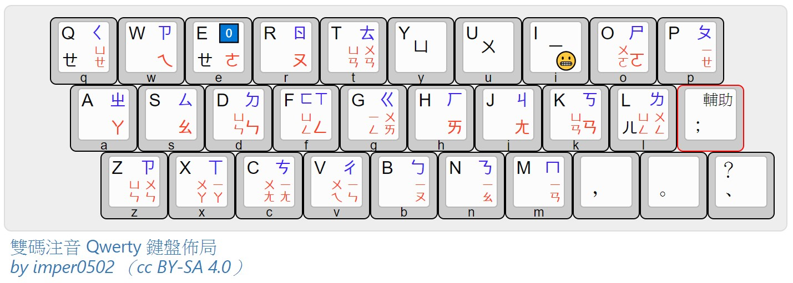

## 量化分析 
### 中文輸入法當量
> 音節當量 = Σ(音節當量 * 音節頻率)

> 音節累計當量 = Σ(音節當量 * 音節累計頻率)

- 單位：1/10秒
- 當量：輸入一個音節，手指花費在移動的時間。類似化學中的**當量**。
- 數值越小，時間越短，該佈局的輸入效率越高。
    
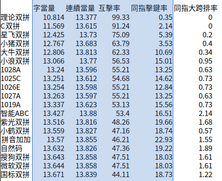

- 測量工具：來源[網路](https://elio.cc/2019/09/spceping.html#%E6%9B%B4%E6%96%B0%E6%97%A5%E5%BF%97)

###  鍵盤熱力圖（Keyboard Heat Map）
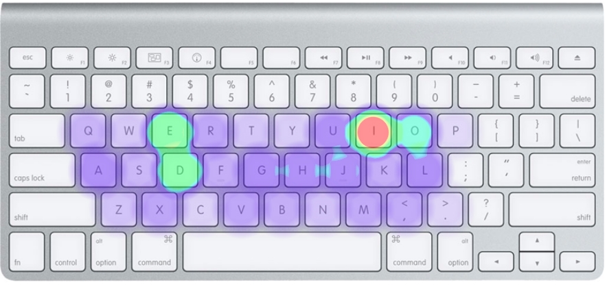

## 實作
### framework: rime
- 編寫設定檔即可。
- 拼寫運算 based on regular expression
- rime 提供的一份字典檔案
    - 一個中文字對應一個拼音
    - 在設定檔內使用 regular expression replace 替換 特定的拼音音節到特定的按鍵上。
    - rime 依據設定的規則，製作查詢字典檔的索引。

### 傳統字碼表：CIN file
- 編寫 Vim Script
- 直接寫 ex 指令的regular expression replace 功能指令在內。
- 替換整個字碼表檔案。

### 比較微軟注音與雙碼注音
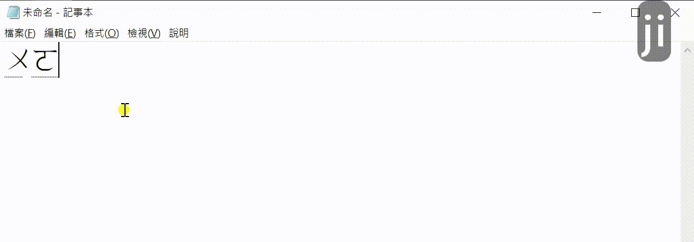

## 回饋與後續影響
### [維基教科書](https://zh.wikibooks.org/wiki/%E9%9B%99%E7%A2%BC%E6%B3%A8%E9%9F%B3%E8%BC%B8%E5%85%A5%E6%B3%95)：
不知道哪一位好心網友製作。

### [未來展望（Github Issue頁面）](https://github.com/imper0502/rime-double-bopomo/issues/13)：
 1. 編寫教材
 2. 網頁版 

### [注音 洋蔥 雙拼 版](https://deltazone.pixnet.net/blog/post/359775341-%E9%9B%BB%E8%85%A6-rime-%E8%A8%AD%E5%AE%9A%E6%AA%94%E3%80%8E-%E6%B4%8B%E8%94%A5-%E9%9B%99%E6%8B%BC-%E6%B3%A8%E9%9F%B3-%E7%89%88-%E3%80%8F)

##  Youtube 影片
1. [受邀社群"鍵人谷"線下聚會一講](https://youtu.be/SD2iaUONg7A)
2. [COSCUP 2020 閃電秀](https://youtu.be/Y2fRB1DPUTQ)

##  Github 頁面
- [Rime Version](https://github.com/imper0502/rime-double-bopomo)

- [Cin Version](https://github.com/imper0502/cin-double-bopomo)

## 【補充】基於字形 v.s. 基於聲調
- 基於字形的輸入法：（不用考慮方言鄉音的問題）
	- 上下形檢字法（林語堂，明快中文打字機）
	- 倉頡檢字法（朱邦復）
	- 嘸蝦米（劉重次）
	- 行列輸入法（廖明德）
- 基於聲調的輸入法：（現代華語發音單一且普及）
	- 拼音、注音

## 【補充】標音方法
- 西方傳教士
    - 特色：類似國際音標
	- 郵政拼音、威妥瑪拼音
	- ㄘ= tsʻ（威妥瑪拼音）
- 東方學者
	- 注音（章太炎）
	- 國語羅馬字（趙元任）
	- 注音二式 
	- 漢語拼音（針對普通語）
	- 通用拼音（華語、臺語、客語）
	- ㄓ= jh（通用） = zh（漢拼）
- IPA

## 【補充】其他拉丁字母鍵盤
### Dvorak keyboard

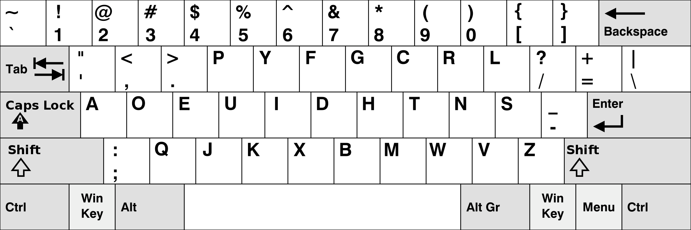

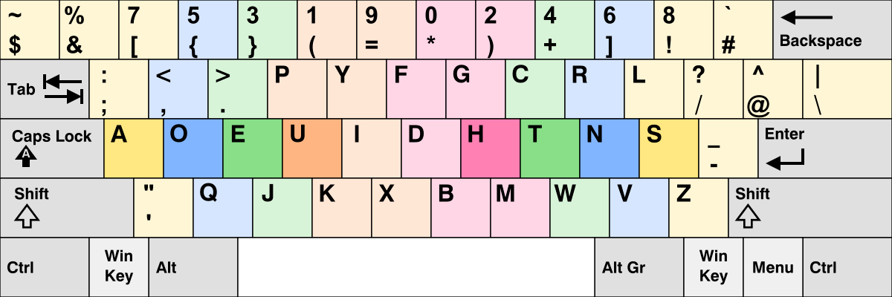

### Colemak Keyboard, Shai Coleman, 2006

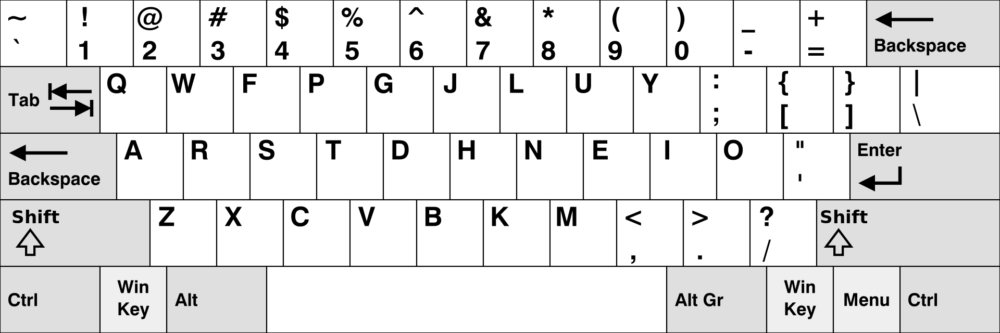