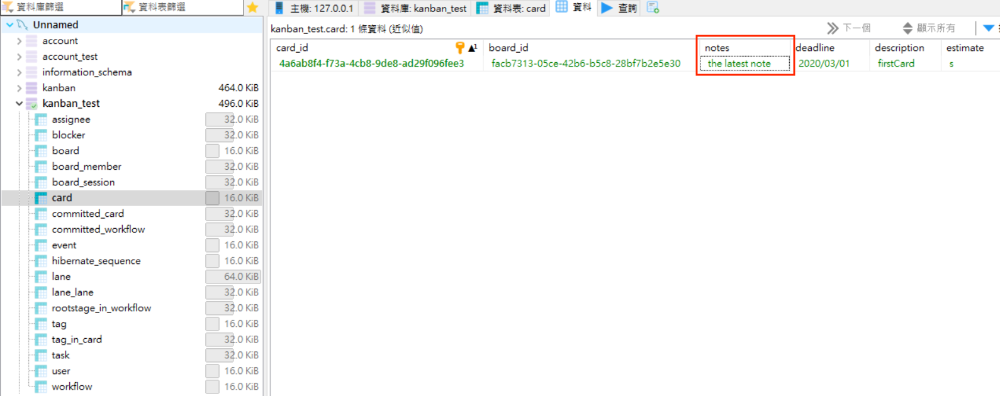
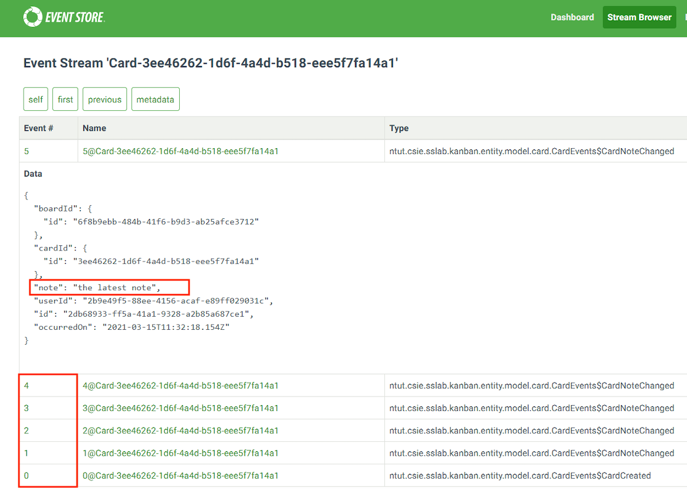
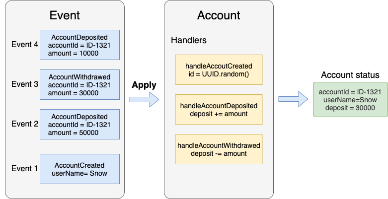

# `Event Sourcing`
`Event Sourcing` is a great way to atomically update state and publish events. The traditional way to persist an entity is to save its current state. Event sourcing uses a radically different, event-centric approach to persistence. A business object is persisted by storing a sequence of state changing events. Whenever an object’s state changes, a new event is appended to the sequence of events. Since that is one operation it is inherently atomic. A entity’s current state is reconstructed by replaying its events.
<br>


## `Event Store`
In the Event Sourcing mode, all events are to be saved to the database, and this storage is called Event Store. 
In addition to providing event data storage and query functions, Event Store can also provide event reproduction and other functions. The recurrence of an event is to take out all events up to a certain time, call his processing function, and generate the business state at that time. So before reproducing, if the state of our business data is saved in the database in the form of a view, we need to clear the corresponding data first. It is precisely because of the event-based feature of the Event Sourcing mode that we can provide such a historical reproduction function. (ex: EventStoreDB)

#### Relational DataBase:


#### EventStore DateBase:



## `Benefit`
- It provides a 100% reliable audit log of the changes made to a business entity
- The data table of the event store is append only, there is no update or select at all, so the performance should be stable and fast.
- It solves one of the key problems in implementing an event-driven architecture and makes it possible to reliably publish events whenever state changes


## `Problem`
- If one of the events is missing, the state of the system will be incorrect
- The event store is difficult to query since it requires typical queries to reconstruct the state of the business entities. That is likely to be complex and inefficient.



#### Card
``` java

public class Card {

    public Card(List<? extends DomainEvent> domainEvents){
		super();
		configEventHandlers();
		domainEvents.forEach( x-> apply(x));
		clearDomainEvents();
    }

    public Card(BoardId boardId,
            WorkflowId workflowId,
            LaneId laneId,
            CardId cardId,
            String description,
            String estimate,
            String note,
            String deadline,
            CardType type,
            String userId) {
        super();
        configEventHandlers();
        apply(new CardEvents.CardCreated(boardId,
                workflowId,
                laneId,
                cardId,
                description,
                estimate,
                note,
                deadline,
                type,
                userId,
                UUID.randomUUID(),
                DateProvider.now()));
    }

    @Override
    public void apply(DomainEvent event){
		when((CardEvents) event);
		addDomainEvent(event);
    }

    private void when(CardEvents event) {
		eventHandlers.getOrDefault(event.getClass(), null).accept(event);
    }

    private void configEventHandlers(){
		eventHandlers.put(CardEvents.CardCreated.class,
				this::handleCardCreated);

		eventHandlers.put(CardEvents.CardMoved.class,
				this::handleCardMoved);

		eventHandlers.put(CardEvents.CardDescriptionChanged.class,
				this::handleCardDescriptionChanged);

		eventHandlers.put(CardEvents.CardNoteChanged.class,
				this::handleCardNoteChanged);

		eventHandlers.put(CardEvents.CardEstimateChanged.class,
				this::handleCardEstimateChanged);

		eventHandlers.put(CardEvents.CardDeadlineChanged.class,
				this::handleCardDeadlineChanged);

    }

    private void handleCardCreated(CardEvents event) {
		CardEvents.CardCreated cardCreated = ((CardEvents.CardCreated) event);
		id = cardCreated.getCardId();
		this.boardId = cardCreated.getBoardId();
		this.workflowId = cardCreated.getWorkflowId();
		this.laneId = cardCreated.getLaneId();
		this.userId = cardCreated.getUserId();
		this.description = cardCreated.getDescription();
		this.type = cardCreated.getType();
		this.estimate = cardCreated.getEstimate();
		this.note = cardCreated.getNote();
		this.deadline = cardCreated.getDeadline();
		this.tasks = new ArrayList<>();
		this.blockers = new ArrayList<>();
		this.tagIds = new HashSet<>();
		this.assignees = new ArrayList<>();
    }


}


```

#### CardEvents
``` java
public class CardEvents extends {
 

    public CardEvents(UUID id, Instant occurredOn) {
        super(id, occurredOn);
    }

    
    public static class CardCreated extends CardEvents {
        private final WorkflowId workflowId;
        private final LaneId laneId;
        private final CardId cardId;
        private final String description;
        private final String estimate;
        private final String note;
        private final String deadline;
        private final CardType type;
        private final String userId;
        private final BoardId boardId;

        @JsonCreator
        public CardCreated(
                @JsonProperty("boardId") BoardId boardId,
                @JsonProperty("workflowId") WorkflowId workflowId,
                @JsonProperty("laneId") LaneId laneId,
                @JsonProperty("cardId") CardId cardId,
                @JsonProperty("description") String description,
                @JsonProperty("estimate") String estimate,
                @JsonProperty("note") String note,
                @JsonProperty("deadline") String deadline,
                @JsonProperty("type") CardType type,
                @JsonProperty("userId") String userId,
                @JsonProperty("id") UUID id,
                @JsonProperty("occurredOn") Instant occurredOn) {
            super(id, occurredOn);
            this.workflowId = workflowId;
            this.laneId = laneId;
            this.cardId = cardId;
            this.description = description;
            this.estimate = estimate;
            this.note = note;
            this.deadline = deadline;
            this.type = type;
            this.userId = userId;
            this.boardId = boardId;
        }

        public WorkflowId getWorkflowId() {
            return workflowId;
        }

        public LaneId getLaneId() {
            return laneId;
        }

        public CardId getCardId() {
            return cardId;
        }

        public String getDescription() {
            return description;
        }

        public String getEstimate() {
            return estimate;
        }

        public String getNote() {
            return note;
        }

        public String getDeadline() {
            return deadline;
        }

        public CardType getType() {
            return type;
        }

        public String getUserId() {
            return userId;
        }

        public BoardId getBoardId() {
            return boardId;
        }
    }

    ///////////////////////////////////////////////////////////////
    public static class CardTypeChanged extends CardEvents {

        private final BoardId boardId;
        private final CardId cardId;
        private final CardType type;
        private final String userId;

        @JsonCreator
        public CardTypeChanged(
                @JsonProperty("boardId") BoardId boardId,
                @JsonProperty("cardId") CardId cardId,
                @JsonProperty("type") CardType type,
                @JsonProperty("userId") String userId,
                @JsonProperty("id") UUID id,
                @JsonProperty("occurredOn") Instant occurredOn) {
            super(id, occurredOn);
            this.boardId = boardId;
            this.cardId = cardId;
            this.type = type;
            this.userId = userId;
        }

        public BoardId getBoardId() {
            return boardId;
        }

        public CardId getCardId() {
            return cardId;
        }

        public CardType getType() {
            return type;
        }

        public String getUserId() {
            return userId;
        }
    }

}
```

#### CardRepositoryEsDbImpl
``` java

public class CardRepositoryEsDbImpl implements CardRepository {

    public static final String CARD_CATEGORY_STREAM_NAME = "`$ce-Card";
    public static final String CARD_CREATED_STREAM_NAME = "$et-" + CardEvents.CardCreated.class.getTypeName();

    private final EsAggregateStorePeer<Card, String> peer;
    private final Class clazz;

    public CardRepositoryEsDbImpl(EsAggregateStorePeer<Card, String> peer, Class clazz, String connectionString) {
        this.peer = peer;
        this.clazz = clazz;
        this.peer.connect(connectionString);
    }

    @Override
    public List<Card> findAll() {
        List<Card> cards = new ArrayList<>();
        for (DomainEvent each : peer.getCategoryEvents(CARD_CREATED_STREAM_NAME)){
            CardEvents.CardCreated event = (CardEvents.CardCreated) each;
            findById(event.getCardId()).ifPresent(cards::add);
        }
        return cards;
    }

    @Override
    public Optional<Card> findById(CardId id) {
        return peer.load(clazz, id.value());
    }

    @Override
    public void save(Card card) {
        if (card.getDomainEvents().size() == 0)
            return;

        peer.save(card);
    }

    @Override
    public void deleteById(CardId cardId) {
        throw new UnsupportedOperationException("deleteById does not supported!");
    }

    @Override
    public void delete(Card card) {
        save(card);
    }

    @Override
    public void close(){
        peer.shutdown();
    }

    @Override
    public List<Card> findCardsByBoardId(BoardId boardId) {
        List<Card> cards = findAll();
        return cards.stream().filter(x -> x.getBoardId().equals(boardId)).collect(Collectors.toList());
    }

    @Override
    public List<Card> findCardsByTagId(TagId tagId) {
        List<Card> cards = findAll();
        return cards.stream().filter(x -> x.getTagIds().contains(tagId)).collect(Collectors.toList());
    }
}
```

# Reference
Event Soucing: https://eventuate.io/whyeventsourcing.html

Event Store : https://www.eventstore.com/blog/what-is-event-sourcing
