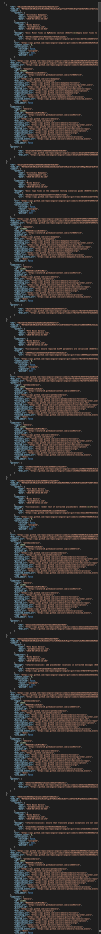

# GitHub API

## Why do we need GitHub API?
- Comparison between repositories  


- Observation of how aggressively the development team deals with issue  

- Observation of the division of labor of the development team  

- A more reable report of repository  
  - GitHub  
  
  - Customized  
  

## Comparison between V3 and V4
  - |       Version      |      V3       |         V4        |
    |:------------------:|:-------------:|:-----------------:|
    |        Type        |     REST      |       GraphQL     |
    | Number of requests |     more      |       less        |
    |  Size of response  |     large     |       small       |
    |    Completeness    |     higher    |       lower       |
    |     Flexibility    |     lower     |       higher      |
    |     Difficulty     |     easy      |       hard        |
<br>

- Example: Get the time of the most 100 recent commits of Angular (test with Postman)

  | Version | V3 | V4 |
  |:-------:|:--:|:--:|
  | Result |  |  |
  | Thumbnail of response |  | 

- Code Demo
  * V3:
    ```
    lock = threading.Lock()
    headers = {"Authorization": f"token {os.getenv('GITHUB_API_TOKEN')}"}

    def _getCount():
        res = requests.get(f"https://api.github.com/repos/angular/angular/commits?per_page=1", headers=headers)

        linkHeaders = res.headers['link'].split(', ')
        for linkHeader in linkHeaders:
            url, rel = linkHeader.split("; ")
            if 'last' in rel:
                return int(parse_qs(url[1:-1])["page"][0])
        return 0

    class CommitDownloader():

        @staticmethod
        def start():
            commits = []
            
            totalCount = _getCount()
            commitThreads = []
            for i in range((totalCount//100)+1):
                commitThreads.append(CommitDownloadThread(commits, i+1))
                commitThreads[i].start()

            for commitThread in commitThreads:
                commitThread.join()

            return commits


    class CommitDownloadThread(threading.Thread):
        def __init__(self, commits, page):
            threading.Thread.__init__(self)
            self.__commits = commits
            self.__page = page

        def run(self):
            res = requests.get(f"https://api.github.com/repos/angular/angular/commits?per_page=100&page={self.__page}", headers=headers)
            if res.status_code == requests.codes.ok:
                commitsJSON = res.json()
                if commitsJSON == []:
                    return
                lock.acquire()

                self.__commits.extend([ commitJSON['commit']['committer']['date'] for commitJSON in commitsJSON ])

                lock.release()

    if __name__ == "__main__":
        commits = CommitDownloader.start()  
    ```
  * V4:
    ```
    lock = threading.Lock()
    headers = {"Authorization": f"token {os.getenv('GITHUB_API_TOKEN')}"}

    def _getCursors():
        query = '''
        {
            repository(owner:"angular", name:"angular") {
                defaultBranchRef {
                    target {
                        ... on Commit {
                            history {
                                pageInfo {
                                    startCursor
                                }
                                totalCount
                            }
                        }
                    }
                }
            }
        }
        '''
        res = requests.post('https://api.github.com/graphql', json={'query': query}, headers=headers)
        if res.status_code == requests.codes.ok:
            resJSON = res.json()
            cursor = resJSON['data']['repository']['defaultBranchRef']['target']['history']['pageInfo']['startCursor'].split(' ')[0]
            count = resJSON['data']['repository']['defaultBranchRef']['target']['history']['totalCount']

            return [ f"{cursor} {n*100}" for n in range(1, math.ceil(count/100)+1) ]
        return []

    class CommitDownloader():

        @staticmethod
        def start():
            commits = []
            
            cursors = _getCursors()
            commitThreads = []

            for index, endCursor in enumerate(cursors):
                commitThreads.append(CommitDownloadThread(commits, endCursor))
                commitThreads[index].start()

            for commitThread in commitThreads:
                commitThread.join()

            return commits

    class CommitDownloadThread(threading.Thread):
        def __init__(self, commits, endCursor):
            threading.Thread.__init__(self)
            self.__commits = commits
            self.__endCursor = endCursor

        def run(self):
            query = '''
            {
                repository(owner:"angular", name:"angular") {
                    defaultBranchRef {
                        target {
                            ... on Commit {
                                history(last:100, before:"%s") {
                                    nodes {
                                        committedDate
                                    }
                                }
                            }
                        }
                    }
                }
            }
            ''' % (self.__endCursor)

            res = requests.post(f"https://api.github.com/graphql", json={'query':query}, headers=headers)
            if res.status_code == requests.codes.ok:
                commitsJSON = res.json()
                lock.acquire()

                self.__commits.extend([ node['committedDate'] for node in commitsJSON['data']['repository']['defaultBranchRef']['target']['history']['nodes'] ])

                lock.release()

    if __name__ == "__main__":
        commits = CommitDownloader.start()
    ```

## Restriction
- Rate limitation

    |        Version       |           V3           |          V4          |
    |:--------------------:|:----------------------:|:--------------------:|
    | Unauthenticated user |  60 requests per hour  | 5000 points per hour |
    |  Authenticated user  | 5000 requests per hour | 5000 points per hour |


  * Calculating points of query for V4

    

- Node limitation (only for V4)
  * Individual calls cannot request more than 500,000 nodes
  * Calculating nodes of query for V4

    

- some API needs higher permission (Ex: Traffic in V3, Collaborators in V4)


