# Git
Git is a free and open source distributed version control system designed to handle everything from small to very large projects with speed and efficiency.

# Fetch
* ### Description
    Download objects and references from another repository.
* ### Command
    1. It would fetch `all of the branches` from the remote repository.
        ```bash
        $ git fetch <remote>
        ```  
        * ### Example
        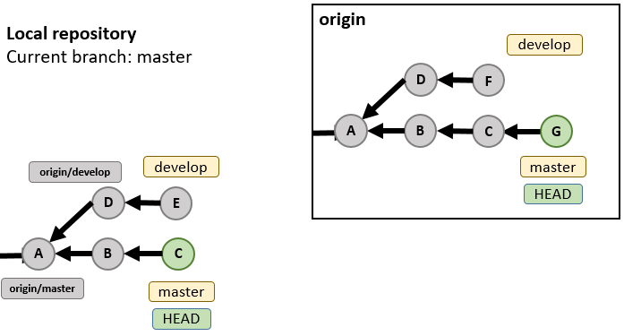 

        `$ git fetch origin`  

        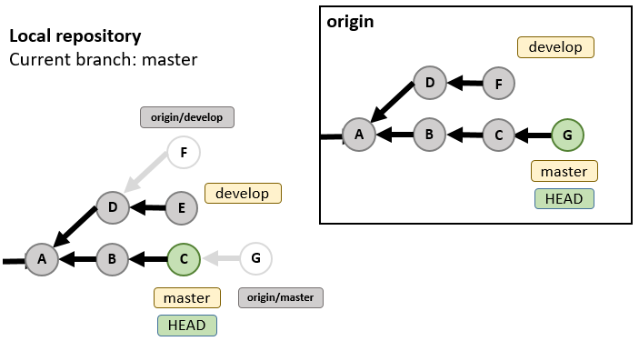  
        > Fetch 1 commit on master  
        > Fetch 1 commit on develop

    ---

    2. It would fetch `<branch>` from the remote repository.
        ```bash
        $ git fetch <remote> <branch>
        ```
        * ### Example
          
        `$ git fetch origin master`  
        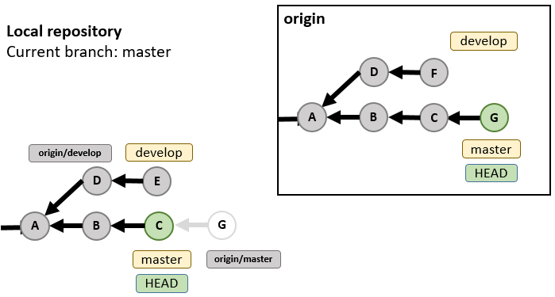  
        > Fetch 1 commit on master  

# Merge
* ### Description
    Join two or more development histories together.
* ### Command
    It would integrate two or more branch to the current branch.
    ```bash
    $ git merge <branch>
    ```
    * ### Example
    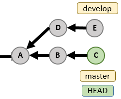  
    `$ git merge develop`  
    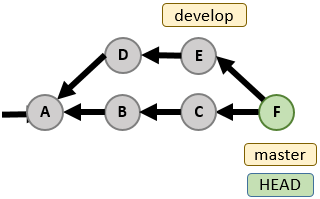

* ### Option
    It would create merge new commit even if fast-forward merge.
    ```bash
    $ git merge <branch> --no-ff
    ```
    * ### Example
    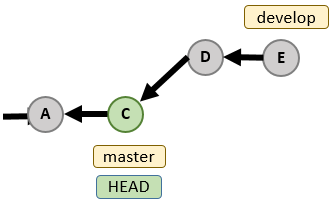  
    `$ git merge develop --no-ff`  
    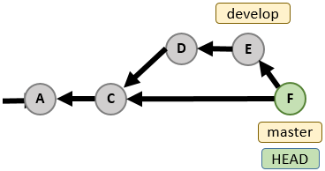  

# Rebase
* ### Description
    Reapply commits on top of another base tip.
* ### Command
    It would rewrites the history of a repository. 
    ```bash
    $ git rebase <branch>
    ```
    * ### Example
    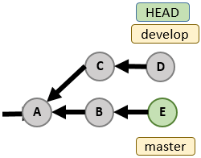  
    `$ git rebase master`  
    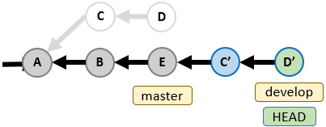

* ### Option
    It would reapply commits which are after `<commit_id>`.  
    ```bash
    $ git rebase -i <commit_id>
    ```
    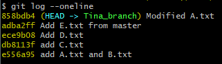  
    `$ git rebase -i e556a95`  
    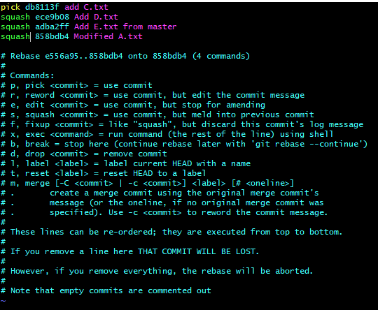  
    `:wq`  
    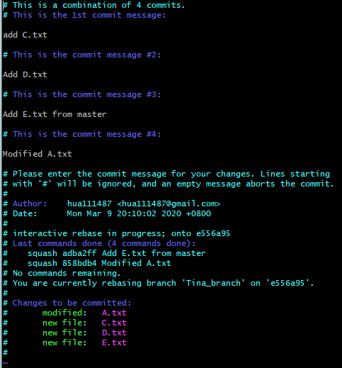  
    `:wq`  
    `$ git log --oneline`  
    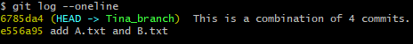  

# Pull
* ### Description
    Fetch from and integrate with another repository.
* ### Command
    1. It would fetch all branches from remote repository, and merge the remote branch whose name is the same as local one.
        ```bash
        $ git pull <remote>
        ````  
        * ### Example
          
        `$ git pull origin`  
        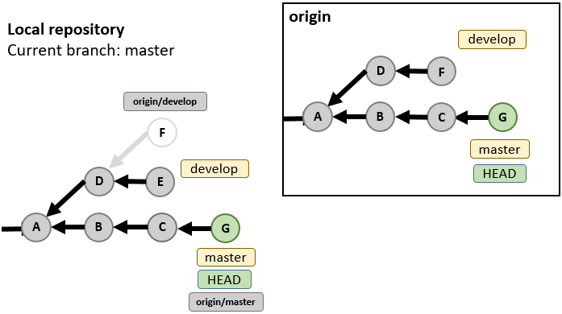

    ---

    2. It would fetch `<branch>` from remote repository, and merge it to the local branch.
        ```bash
        $ git pull <remote> <branch>
        ````  
        * ### Example
          
        `$ git pull origin master`  
        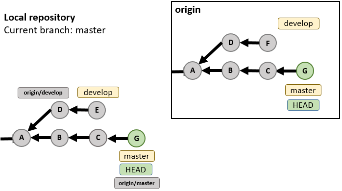

# Push
* ### Description
    Update remote refs along with associated objects.
* ### Command
    ```bash
    $ git push <remote> <branch>
    ```
    * ### Example
    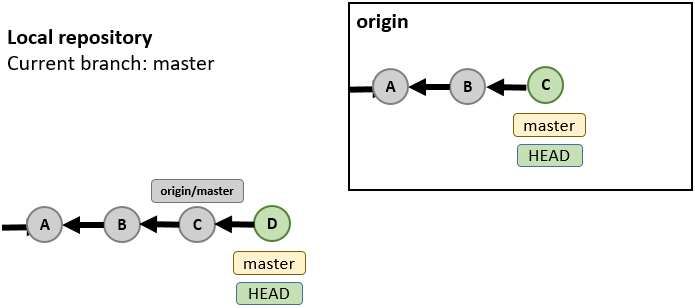  
    `$ git push origin master`  
    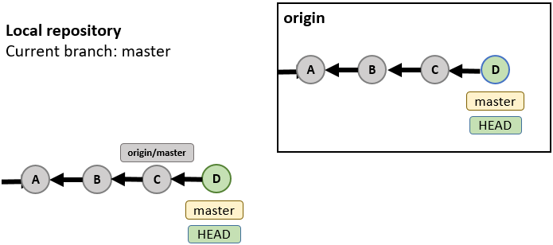

* ### Option
    1. It would overwrite the remote commits that are different from local branch by local ones.
        ```bash
        $ git push <remote> <branch> --force
        ```
        * ### Example
        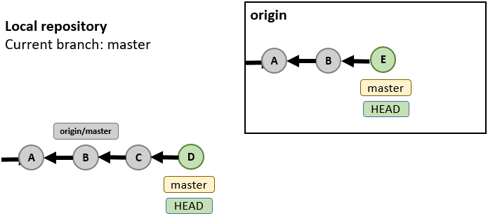  
        `$ git push origin master --force`  
        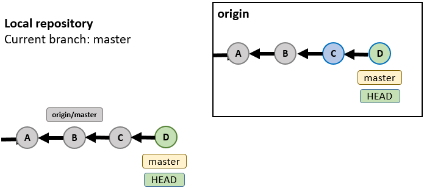

    --- 
    2. It would overwrite the remote commits that are different from local branch by local ones.  
        But if the local repository is not the newest, it would be rejected.  
        ```bash
        $ git push <remote> <branch> --force-with-lease  
        ```  
        * ### Example
        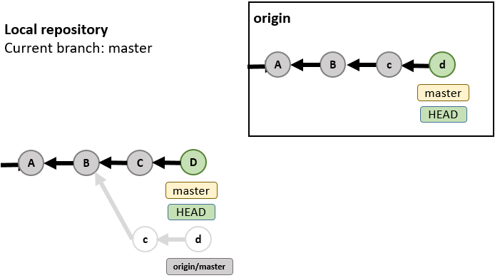  
        `$ git push origin master --force-with-lease`  
        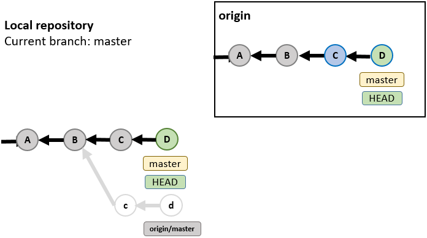

# Cherry-pick
* ### Description
    Apply the changes introduced by some existing commits.
* ### Command
    It would copy the change from `<commit_id>` commit and create a new commit for it.  
    ```bash
    $ git cherry-pick <commit_id>
    ```
    master branch  
    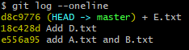  
    `$ git checkout Tina_branch`  
    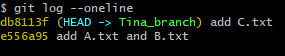  
    `$ git cherry-pick 18c428d`  
    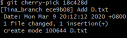  
    `$ git log --oneline`  
    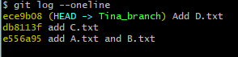  
* ### Option
    1. It would copy the change from `<commit_id>` commit to working directory.  
        ```bash
        $ git cherry-pick <commit_id> --no-commit
        ```
        master branch  
        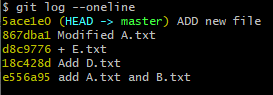  
        Tina_branch  
          
        `$ git cherry-pick d8c9776 --no-commit`  
        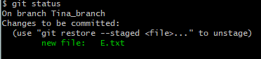  

    ---

    2. When the conflict occurs, you can run them.  
        ```bash
        $ git cherry-pick <commit_id> --continue
        $ git cherry-pick <commit_id> --abort
        $ git cherry-pick <commit_id> --quit
        ```
        * If you want to **go on** the next git cherry-pick, you can use `--continue` after you resolved the conflict.  
        * If you want to **cancel** this git cherry-pick, you can use `--abort`.  
          It will revert the current branch status before running git cherry-pick.  
        * If you want to **exit** this git cherry-pick, you can use `--quit`.  
          It would save the changes of files which don't occur conflict.  

# Log
* ### Description
    Show commit history.
* ### Command
    It would show commit ID, name and email of author, date to log and commit message.  
    ```bash
    $ git log
    ```
    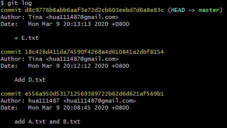

* ### Option
    1. It would show part of commit ID and its message.  
        ```bash
        $ git log --oneline
        ```
        
        
    ---  
    
    2. It would show the graph of commit history.  
        ```bash
        $ git log --graph  
        ```
        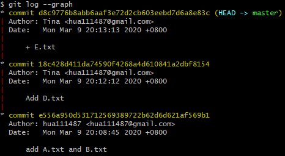  
        
    ---
    
    3. It would show commits whose author are `<author_name>`. 
        ```bash
        $ git log --author="<author_name>"  
        ```
        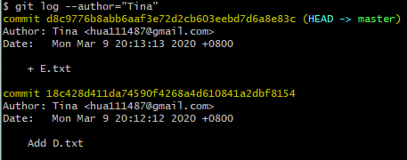  
        
    ---  
    
    4. It would show commits whose message contain `<pattern>`.  
        ```bash
        $ git log --grep="<pattern>"  
        ```
        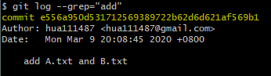  

# Compare
* Fetch and Pull  

| Fetch | Pull |
| ------- | ------ |
| Just downloads the objects and references from a remote repository and normally updates the remote tracking branches. | Not only downloads the changes, but also merges them.  It is the combination of fetch and merge. |

* Merge and Rebase

|  | Merge | Rebase |
| -- | ------- | ------ |
| Commit ID | Create new merge commit and keep **origin commit ID** | run cherry-pick and create **new commit ID** |
| Conflict | Resolve the conflict **in merge commit** | Resolve the conflict **in each cherry-pick** |
| Commit tree | **Two** parents | Just **one** parent |
| Git log | **Can not** present the order of commit | **Can** present the order of commit |
| When to use | When the branch has **two or more** developer | When the branch has only **one** developer |

# Reference
1. [TortoiseGit](https://tortoisegit.org/docs/)
2. [Git](https://git-scm.com/book/en/v2)
3. [為你自己學 Git](https://gitbook.tw/)
4. [Git Tutorials and Training](https://www.atlassian.com/git/tutorials)
5. [GitBook](https://zlargon.gitbooks.io/git-tutorial/content/branch/merge.html)
