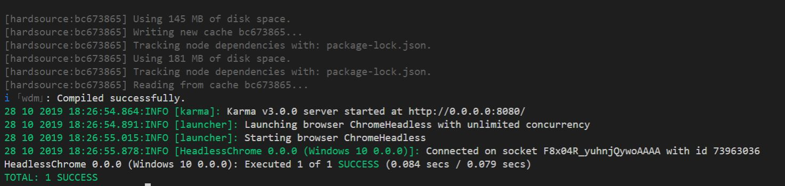

# Using Karma for Testing by Jasmine framework

## Karma Test Tool

Karma是一種能夠配合不同的測試框架(如:Jamsine, mocha等)，可進行自動化的單元測試的一種測試執行工具。

## Jasmine Framework

Jasmine一個針對Javascript的驅動行為開發(Behavior-Driven Development)的測試框架。Jasmine定義describe語法為測試集(Suite)，並定義it語法為一個參數規格(Specification)，或簡稱為Spec。

beforeEach指的是在每個it執行前先執行，是同步執行。afterEach指的是在每個it執行後執行，是同步執行。

```js
describe('Test Suite', function(){
    beforEach(function(){
        //Set Up
        ...
    });

    afterEach(function(){
        //TearDown
        ...
    });

    it('Test Specification', function(){
        ...
    });
});
```

## Compare toBe and toEqual

在Jasmine的語法中，toBe是驗證value是否相等，使用===來判斷否相等；而toEqual則是在透過兩者object的property來進行驗證，使用Object.is來判斷是否相等。

```js
describe('Test Suite', function(){
    it('Test Specification', function()
        const objA = { A: 1 };
        const objB = { B: 1 };

        expect(objA).toEqual(objB); //sucsess
        expect(objA.A).toBe(objB.B); //success
        expect(objA).toBe(objB); //failure
    });
});
```

## Angular-mocks

AngularJs提供ngMock的Module，所以我們當我們在做測試時，可以透過ngMock模擬Module並使用Dependency Injection的方式Inject所需的Dependency。

```js
describe('Test Suite', function(){
    var myService;
    beforeEach(angular.mock.module('myApp'));
    beforEach(angular.mock.inject(function(_myService_, ...){
        myService = _myService_;
        ...
    }));
    it("Test Specification", function(){
        //myService.test function will return Hello
        expect(myService.test).toBe("Hello");
        ...
    });
});
```

## Test Service For Example

`item-grid.service.spec.js`
```js
'use strict';

import mockItemGridService from "./item-grid.service-mock";
describe('itemGridService', function () {
    var $rootScope;
    var scope;
    var itemGridService;
    var myMockItemGridService = new mockItemGridService;

    beforeEach(angular.mock.module('app'));

    beforeEach(inject(function (_$rootScope_, _itemGridService_) {
        $rootScope = _$rootScope_;
        scope = $rootScope.$new();
        itemGridService = _itemGridService_;
    }));

    describe('test itemGridService', function () {
        it('test itemGridService.getItemListGridColDef', function () {
            scope.fixedColumns = ['tiName', 'tiClass', 'cmbMake', 'cmbModel', 'cmbLocation', 'cmbStatus'];
            scope.selectedFilterOptions = [];
            scope.filterSettings = [];

            var dataTypes = myMockItemGridService.getFilterFields();

            var fields = [
                {
                    "label": "Type",
                    "value": null,
                    "uiPanelId": "identity",
                    "uiComponentId": "cmbType",
                    "lookupTypeName": "TYPE",
                    "sortOrder": 23,
                    "applicableClasses": "1200,1300,1500,2200,2100,1100,1400,2300,2400,3000",
                    "visible": true,
                    "isConfigurable": true
                },

                ...
            ]

            var data = itemGridService.getItemListGridColDef(scope, fields, dataTypes);
            data.forEach(function (element) {
                element.headerCellClass = 'function';
            });
            var result = myMockItemGridService.getItemListGridColDef();

            expect(data[0].field).toBe(result[0].field);
            expect(data[0].displayName).toBe(result[0].displayName);
            expect(data[0].enableHiding).toBe(result[0].enableHiding);
            expect(data[0].enableCellEdit).toBe(result[0].enableCellEdit);
            ...
        });
    });
});
```

`item-grid.service-mock.js`
```js
'use strict';

    function mockItemGridService(){

        var service = {
            getItemListGridColDef: getItemListGridColDef,
            getFilterFields: getFilterFields
        };
    
        return service;
        
        function getItemListGridColDef(){
            var result = [
                {
                    field: 'cmbType', 
                    displayName: 'Type', 
                    enableHiding: true, 
                    enableCellEdit: false, 
                    cellTooltip: true,
                    enableColumnResizing: true, 
                    visible: true, 
                    enableFiltering: true, 
                    width: 100, class: 'common', 
                    stdOrCust: 'standardField', 
                    panelId: 'identity', 
                    lookupTypeName: 'TYPE', 
                    headerCellClass: 'function'
                },
                ...
            ];

            return result;
        }

        function getFilterFields(){
            var fieldTypeList = [];
            fieldTypeList["_piqId"] = {type: "numberRange"};

            ...

            return fieldTypeList;
        }
    }

export default mockItemGridService;
```

測試結果如下所示



## Conclusion

隨著專案程式的增長，測試的重要性也逐漸提升，所以撰寫測試可使得開發功能時的錯誤率下降，進而提升整體開發效能。

## Reference

https://docs.angularjs.org/guide/unit-testing

https://scotch.io/tutorials/testing-angularjs-with-jasmine-and-karma-part-1
