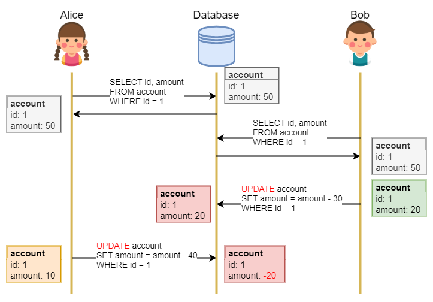
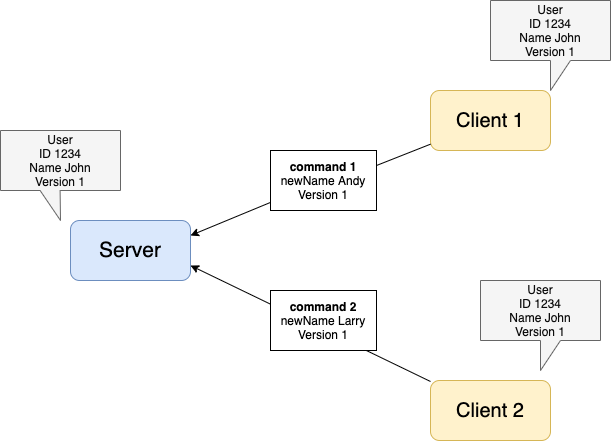
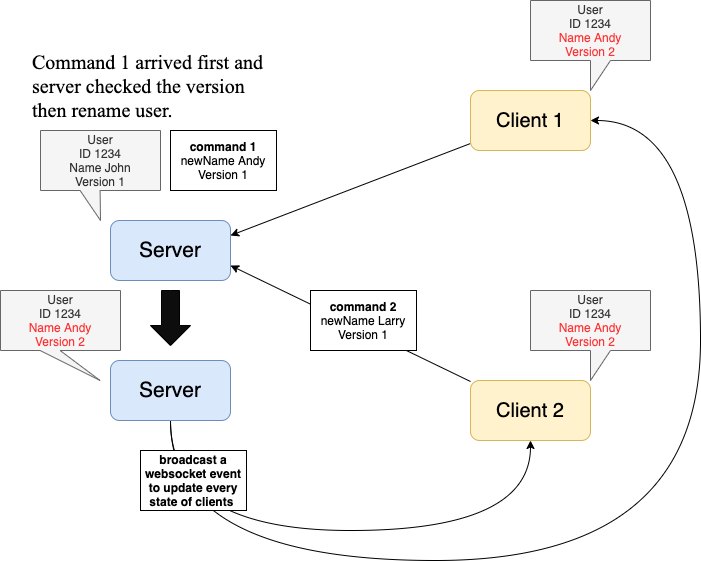
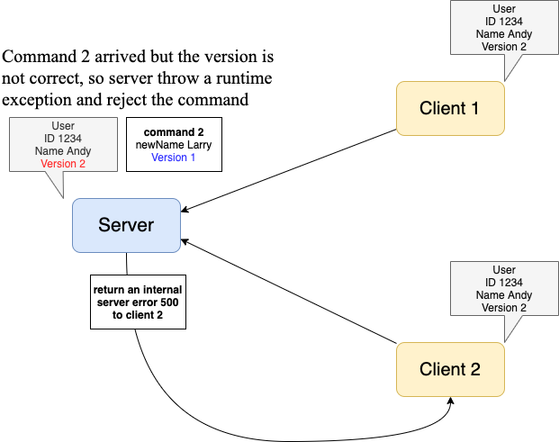
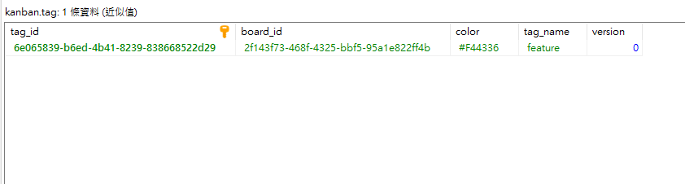
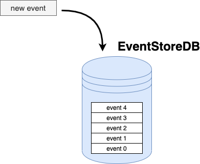
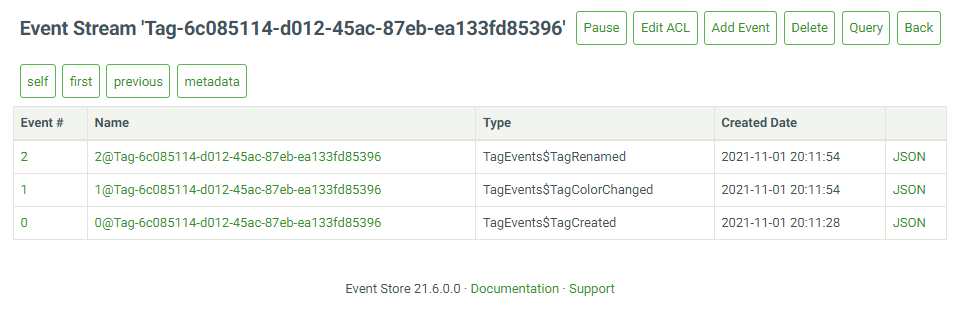

# `Optimistic Locking`
### Problem


### Definition
Optimistic concurrency control (OCC), also known as optimistic locking, is a concurrency control method applied to transactional systems such as relational database management systems and software transactional memory.  

Before committing, each transaction verifies that no other transaction has modified the data it has read. If the check reveals conflicting modifications, the committing transaction rolls back and can be restarted.

Optimistic locking is generally used in environments with low **data contention** *(multiple processes or instances competing for access to the same index or data block at the same time)*.  

When conflicts are rare, transactions can complete without having transactions wait for other transactions' locks to clear, leading to higher throughput than other concurrency control methods. 


### Example
##### Client 1 and Client 2 made a command at the same time  

##### command 1 arrived first  

##### command 2 arrived later  



- In a multi-user collaborative kanban system, multiple users often access and change the state of the same card at the same time, which may cause incorrect aggregate state.
#### Relational Database  
TagData.java  
``` java
@Entity
@Table(name="tag")
public class TagData {

	@Id
	@Column(name="tag_id")
	private String tagId;

	@Column(name = "board_id", nullable = false)
	private String boardId;

	@Column(name = "tag_name")
	private String tagName;

	@Column(name = "color")
	private String color;

	@Version
	@Column(columnDefinition = "bigint DEFAULT 0", nullable = false)
	private long version;

	public TagData(){
		this(0l);
	}

	public TagData(long version){
		this.version = version;
	}

	...

	public long getVersion() {
		return version;
	}

	public void setVersion(long version) {
		this.version = version;
	}
}
```
ChangeTagColorUseCaseImpl.java  
```java
public class ChangeTagColorUseCaseImpl implements ChangeTagColorUseCase{

    private TagRepository tagRepository;
    private DomainEventBus domainEventBus;

    public ChangeTagColorUseCaseImpl(TagRepository tagRepository, DomainEventBus domainEventBus) {
        this.tagRepository = tagRepository;
        this.domainEventBus = domainEventBus;
    }

    @Override
    public void execute(ChangeTagColorInput input, CqrsCommandOutput output) {
        try{
            Tag tag= tagRepository.findById(TagId.valueOf(input.getTagId())).orElse(null);
            if (null == tag){
                output.setId(input.getTagId())
                        .setExitCode(ExitCode.FAILURE)
                        .setMessage("Change tag color failed: tag not found, tag id = " + input.getTagId());
                domainEventBus.post(new ClientBoardContentMightExpire(BoardId.valueOf(input.getBoardId()), UUID.randomUUID(), DateProvider.now()));
                return;
            }

            tag.setVersion(input.getVersion());
            tag.changeColor(input.getNewColor(), input.getUserId());

            tagRepository.save(tag);
            domainEventBus.postAll(tag);

            output.setId(input.getTagId());
            output.setExitCode(ExitCode.SUCCESS);
        }
        catch (Exception e){
            throw new UseCaseFailureException(e);
        }
    }

    ...
}
```
TagRepositoryImpl.java  
```java
public class TagRepositoryImpl implements TagRepository {

    private TagRepositoryPeer tagRepositoryPeer;

    public TagRepositoryImpl(TagRepositoryPeer tagRepositoryPeer) {
        requireNotNull("TagRepositoryPeer", tagRepositoryPeer);

        this.tagRepositoryPeer = tagRepositoryPeer;
    }

   ...

    @Override
    public void save(Tag tag) {
        requireNotNull("Tag", tag);

        try {
            tagRepositoryPeer.saveAndUpdateVersion(tag);
        }
        catch (ObjectOptimisticLockingFailureException e){
            throw new RepositorySaveException(RepositorySaveException.OPTIMISTIC_LOCKING_FAILURE, e);
        }
    }

  ...
}
```

TagRepositoryPeer.java  
```java
@Repository
public interface TagRepositoryPeer extends CrudRepository<TagData, String> {
    
    ...

    @Modifying
    @Transactional
    @Query(value = "UPDATE TagData as c SET c.version = :version WHERE c.tagId = :tagId")
    void updateVersion(@Param("tagId") String tagId, @Param("version") long version);

    @Transactional
    default void saveAndUpdateVersion(Tag tag){
        save(TagMapper.toData(tag));
        if (tag.getDomainEventSize() > 1) {
            updateVersion(tag.getTagId().id(), getVersion(tag));
        }
        tag.setVersion(getVersion(tag));
    }

    private long getVersion(AggregateRoot aggregateRoot) {
        return aggregateRoot.getVersion() + aggregateRoot.getDomainEventSize();
    }
}
```  
  
#### Event Store  
##### Event Sourcing  
- A business object is persisted by storing a sequence of state changing events.  
- Whenever an object’s state changes, a new event is appended to the sequence of events.  
- A entity’s current state is reconstructed by replaying its events.  
  

TagRepositoryEsDbImpl.java  
```java

public class TagRepositoryEsDbImpl implements TagRepository {

    public static final String TAG_CATEGORY_STREAM_NAME = "$ce-Tag";
    public static final String TAG_CREATED_STREAM_NAME = "$et-" + TagEvents.TypeMapper.TAG_CREATED;

    private final EsAggregateStorePeer<Tag, String> peer;
    private final Class clazz;

    public TagRepositoryEsDbImpl(EsAggregateStorePeer<Tag, String> peer, Class clazz, String connectionString) {
        requireNotNull("EsAggregateStorePeer", peer);
        requireNotNull("Connection string", connectionString);

        this.peer = peer;
        this.clazz = clazz;
        if (null != peer){
            peer.shutdown();
            this.peer.connect(connectionString);
        }
    }

    ...

    @Override
    public void save(Tag tag) {
        requireNotNull("Tag", tag);

        if (tag.getDomainEvents().size() == 0)
            return;

        peer.save(tag);
    }
}
```
EsAggregateStorePeer.java  
```java
public class EsAggregateStorePeer<T extends AggregateRoot, ID> {

    private EventStoreDBClient client;
    private final DomainEventTypeMapper domainEventTypeMapper;

    public EsAggregateStorePeer(DomainEventTypeMapper mapper) {
        super();
        this.domainEventTypeMapper = mapper;
    }

    ...

    public void save(T aggregate) {
        if (null == aggregate){
            throw new RuntimeException("Aggregate cannot be null.");
        }
        List<EventData> eventDatas = new ArrayList<>();
        aggregate.getDomainEvents().stream().forEach(domainEvent -> {
            eventDatas.add(
                    EventDataBuilderJava8.json(domainEventTypeMapper.toMappingType((DomainEvent) domainEvent), domainEvent)
                    .build());
        });

        try {
            AppendToStreamOptions options;
            if (-1 == aggregate.getVersion()){
                aggregate.setVersion(0);
            }
            if (0 == aggregate.getVersion()){
                options = AppendToStreamOptions.get()
                        .expectedRevision(ExpectedRevision.ANY);
            }
            else{
                options = AppendToStreamOptions.get()
                        .expectedRevision(new StreamRevision(aggregate.getVersion()));
            }
            WriteResult writeResult = client
                    .appendToStream(getStreamName(aggregate), options, eventDatas.iterator())
                    .get();
            aggregate.setVersion(writeResult.getNextExpectedRevision().getValueUnsigned());
        }
        catch (InterruptedException | ExecutionException e ) {
            throw new RuntimeException(e);
        }
    }

    ...

}

```
  
### Advantage  
Here are the advantages of optimistic locking:  
  - It prevents users and applications from editing stale data.  
  - It notifies users of any locking violation immediately, when updating the object.  
  - It does not require you to lock up the database resource.  
  - It prevents database deadlocks.  


### Disadvantage  
  - An unnecessary amount of time can pass before a transaction is aborted.  
  (The version verification is not executed until the transaction is committed, but a difference in the versions can occur much earlier.)  

  - The cost of repeatedly restarting transactions hurts performance significantly if contention for data resources is frequent.  

  - Optimistic locking cannot prevent applications from selecting and attempting to modify the same data.(Compare with pessimistic locking)  
  (When two different processes modify data, the first one to commit the changes succeeds; the other process fails and receives an OptimisticLockException.)  

    
### Relational:  Pessimistic Locking  
Pessimistic concurrency control (or pessimistic locking) is called “pessimistic” because the system assumes the worst — it assumes that two or more users will want to update the same record at the same time, and then prevents that possibility by locking the record, no matter how unlikely conflicts actually are.  

However, locking-based ("pessimistic") methods also can deliver poor performance because locking can drastically limit effective concurrency even when deadlocks are avoided.  

- ezKanban is usually hanppend concurent access, so we decide not to use pessimistic locking.  

##### Pessimistic Locking vs Optimistic Locking  
|Basis| Pessimistic| Optimistic |
|:-|:-|:-|
|Conflict|Large number of transactions will conflict with each other|Relatively less number of trasactions is in conflict with each other|
|Implementation|Simple|Moderate|
|Suitable|Transactions conflicts are more| Transactions conflicts are very rare|
|Storage cost|Lower|Higher|
|Concurrent access|Resource cannot be access till previous transaction finished|Check the current state of resource, if version conflict will failed fast 


### Reference  
Optimistic concurrency control: https://en.wikipedia.org/wiki/Optimistic_concurrency_control  
Using Optimistic Locking: https://docs.oracle.com/cd/B14099_19/web.1012/b15901/dataaccs008.htm  
Pessimistic and optimistic locking: https://docs.jboss.org/jbossas/docs/Server_Configuration_Guide/4/html/TransactionJTA_Overview-Pessimistic_and_optimistic_locking.html?fbclid=IwAR3H-ANoOCYn4AWyHJ0tk3GBclaoMlxW19vw7z0wHcf60dQaM-UaGA0FrHQ  
Optimistic Concurrency Control: https://docs.telerik.com/help/openaccess-classic/concurrency-control-optimistic.html  
PESSIMISTIC vs. OPTIMISTIC concurrency control: https://support.unicomsi.com/manuals/soliddb/100/index.html#page/SQL_Guide/5_ManagingTransactions.06.4.html