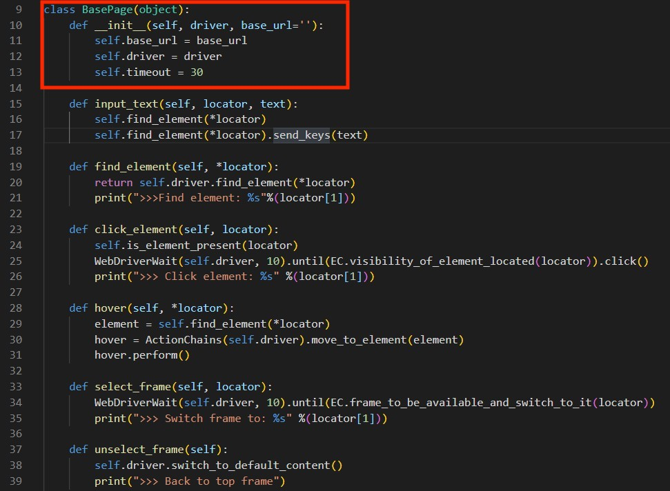

# __Page Object Pattern__

## `Problem`
No POM problem:
- It's hard to unify webdriver time out
- locator are hard to reuse, EX: xpath etc.

 
 

## `What is Page Object ?`
`Page Object` pattern is a design pattern for test automation.
At the begining, we write our test logic to the test case and seperate from other pages.
Next, each page will collocate with its own locators(xpath, id etc.). And this page will become a independent page object. Then through inheriting base page, letting page object do their own operation.
 

| nonPOM   |   POM    |
| :------: | :------: |
| | |

### `test case`

### `page object`
 

### `Class Diagram`

| PageObject | ScreenShot |
| :------: |:------: |
| Basepage (BasePage.py)|  |
| CircuitsListPage (CircuitsListPage.py)| |
| LoginPage (LoginPage.py)| |
| HomePage (HomePage.py)| |
| RequestPage (request.py)| |
| Locators (Locators.py)| |

## `Advantage`
- Creating reusable code
- If the user interface changes, the fix needs changes in only one place
- high maintainance

## `Reference`
[selenium-Python](https://selenium-python.readthedocs.io/page-objects.html) 
[medium](https://medium.com/drunk-wis/python-selenium-webdriver-page-object-model-design-pattern-%E7%9A%84%E4%B8%80%E4%BA%9B%E6%83%B3%E6%B3%95-6d8cc0e156a6)