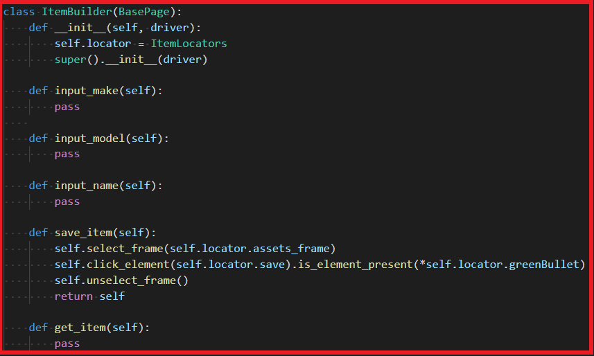

# __Page Object Pattern II__

<!-- solution via usage, new test creations, creation of new page components, and readibility of tests. -->

## Problem
Test Scenario 1: As a user, user wants to create item on `item detail page`.
<br/>(version 1.0)
```
Test step:
1. Login to dashboard.
2. Go to item list page.
3. Click `add an item` button.
4. Input `Make: 3Com`, `Model: Blade 3C13872 `, `Item Name: ITEM1020` and save item.
5. Verify the `ITEM1020` is created.
```
Test Scenario 2: As a user, user wants to create item by `file import`.
<br/>(version 2.0)
```
Test step:
1. Login to dahsboard
2. Go to item list page.
3. Click `Import` button.
4. Prepare `Make: 3Com`, `Model: Blade 3C13872 `, `Item Name: ITEM1020` csv file.
5. upload csv file.
6. Verify the `ITEM1020` is created.
```


## `In Robot Framework`


#### Item Detail


#### File Import

### Conclusion: **The test code need to modify when the user use different way to create item.**

## `In Python`
### Class Diagram


### Test Case


### Implementation
| Page/Pattern | ScreenShot |
| ------ |------ |
|`Builder`|<br><br>|
|`Assets Page`||
|`Factory`||

### Fluent Page Object Model


## Reference
[Fluent Page Object Model](https://kobiton.com/book/chapter-12-test-automation-design-patterns-you-should-know)<br>
[Design Pattern For Test Automation](https://www.devbridge.com/articles/top-design-pattern-test-automation-frameworks/)
