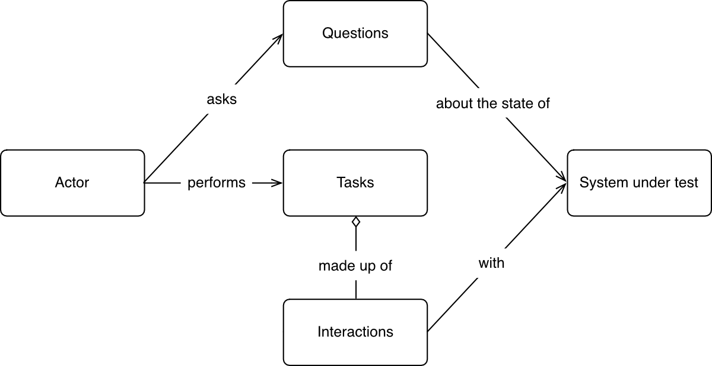

# __Screenplay Pattern__

<br>

## `Outline`
+ [Screenplay](#screenplay)
  - The four elements
  - Gherkin syntax
  - Scenario decomposition
  - Modelling
+ [Project](#project)

+ [Issue](#issue)

<br>
<br>

## `Screenplay`
<br>

&nbsp;&nbsp;&nbsp;&nbsp;&nbsp;
Describe test scenarios in a similar way that describe them to a human being - _an `actor` in `Screenplay`_ - speak. Writing simple, readable code that instructs the `actors` what activities to perform and what things to check.

<br>

<!--Elements of real Screenplay : **Scene handling**, **Action**, **Character**, Dialogue, Transition-->
<br>

### `The four elements`

<br>

+ `Actors` : A key element of the pattern as they are the ones performing the test scenarios (`Who`)<br>&nbsp;&nbsp;example: different permission accounts

+ `Tasks` : Higher-level abstractions that model the activities an actor needs to perform in business domain terms (`What`)<br>&nbsp;&nbsp;example: order a book

+ `Interactions` : The job of an actor is to attempt to perform a series of interactions with the system under test (`How`)<br>&nbsp;&nbsp;example: click an element (UI actions)

+ `Questions` : Actor use questions to test their assumptions or to check their expectations about what the results of the outcome should be.<br>&nbsp;&nbsp;example: check the states

<br>

`actor-centric model`
<br>



<br>
<br>

### `Gherkin syntax`

&nbsp;&nbsp;&nbsp;&nbsp;&nbsp;
Gherkin is the format for cucumber specifications. It is a domain specific language which helps you to describe business behavior without the need to go into detail of implementation.
<br>
<br>

+ Feature <!-- high-level description of a software feature -->
+ User story
+ `Scenario`
  - `Given` : pre-condition
  - `When` : actions or events
  - `Then`: expected results or consequences

<br>

```feature
Feature: Discount codes for selected products

  In order to increase the sales of the products I want to destock
  As a sales manager
  I want to enable customers to buy them at a discounted rate


  Scenario: Using a discount code received from the online store
    Given that I have received the SMARTPHONE_15 discount code
     When I shop for a smartphone
      And I apply my discount code at checkout
     Then I should see that the total price is reduced by 15%
```

<br>

### `Scenario decomposition`

<br>
<!-- Hierarchical Task Analysis -->
<!-- BDD形式 去描述(呈現)測試主腳本, 再以top-down的方式去實作
<br>
Given -> tasks or setup
<br>
When -> tasks -> interactions
<br>
Then -> questions -> interactions
<br> -->

```feature
Scenario: Using a discount code received from the online store

├── Given that I have received the SMARTPHONE_15 discount code
├── When I shop for a smartphone
│   ├── Visit the store
│   ├── Find a smartphone
│   │   ├── Visit the electronics and photo department
│   │   └── Pick a smartphone
│   └── Add the smartphone to the basket
├── And I apply my discount code at checkout
│   ├── Proceed to checkout
│   └── Apply the discount code
└── Then I should see that the total price is reduced by 15%
    ├── Read the total price of the basket
    └── Ensure that the 15% discount is applied
```
<br>

Tasks
```feature
├── When Visit the store
│    And Visit the electronics and photo department
│        Pick a smartphone
│        Add the smartphone to the basket
│        Proceed to checkout
│        Apply the discount code
│
└── Then Read the total price of the basket
         Ensure that the 15% discount is applied
```
<br>

Interactions
```feature
├──  When Visit the store
│          └── Go to 'store'                            # Interaction
│         Visit the electronics and photo department
│          └── Go to 'electronics and photo department' # Interaction
│         Pick a smartphone
│          └── Go to 'Commodity'                        # Interaction
│         Add the smartphone to the basket
│          └── Click on 'Add commodity'                 # Interaction
│         Proceed to checkout
│          ├── Click on 'View basket'                   # Interaction
│          └── Click on 'Proceed to checkout'           # Interaction
│         Apply the discount code
│          └── Choose the 'Discount code'               # Interaction
└──  Then Read the total price of the basket
           └── Check the 'Basket'                       # Question
          Ensure that the 15% discount is applied
           └── Check the 'Bill'                         # Question
```
<br>

### `Modelling`

<br>
file structure

```feature
├── questions
│   ├── check the total price
│   └── check the discount
│
├── tasks
│
├── interactions
│   ├── go to ...
│   ├── click ...
│   └── choose ...
│
└── user_interface
    ├── the store
    ├── the departments
    ├── the basket
    └── the cashier
```
<br>
<br>

## `Project`

### `test case`
```feature
Name(Summary): Test changing a selected item

Steps:
1.Select an item and a port for Node 1. Change the selection of the item.
2.Select an item and a port for Node 2. Change the selection of the item.

Result: 
1.The right-side grid is changed to the new item's ports
2.The right-side grid is changed to the new item's ports

  Scenario: New item's ports are visible after changing a selected item
    Given Select an item and a port for Node 1
     When Change the selection of the item
     Then The right-side grid is changed to the new item's ports
    Given Select an item and a port for Node 1
     When Change the selection of the item
     Then The right-side grid is changed to the new item's ports 
```

<br>

### `test case without actor`
```feature
Name(Summary): Search field type in circuit list
Description: Verify the type of search fields depend on the type of column.

Steps: Check search field of column header in circuit list grid.

Result: For string, the type is text; for single and multi select type, the type is drop down with listbox.
```
<br>
<br>

## `Issue`
+ Detail in script
+ Hierarchy of tasks
+ Task and UI design
+ Bottom-up or top-down
+ Setup and teardown
<br>
<br>

## `Reference`
[Page Objects Refactored: SOLID Steps to the Screenplay/Journey Pattern - DevOps Zone](https://dzone.com/articles/page-objects-refactored-solid-steps-to-the-screenp)<br>
[User-Centred Design: How a 50 year old technique became the key to scalable test automation](https://janmolak.com/user-centred-design-how-a-50-year-old-technique-became-the-key-to-scalable-test-automation-66a658a36555)<br>
[Screenplay pattern in serenity - Serenity-js](https://serenity-js.org/handbook/thinking-in-serenity-js/screenplay-pattern.html)<br>
[robotframework-Creating test cases - Github](https://github.com/robotframework/robotframework/blob/master/doc/userguide/src/CreatingTestData/CreatingTestCases.rst#behavior-driven-style)
<!-- [Screenplay Pattern - Medium](https://medium.com/testvagrant/screenplay-pattern-3490c7f0c23c)<br> -->