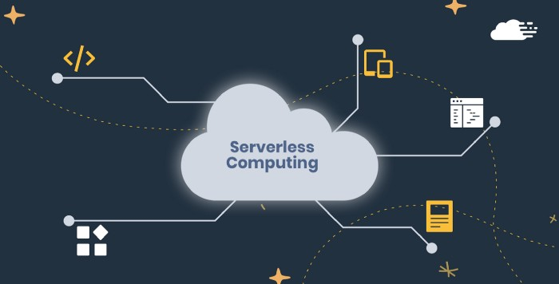
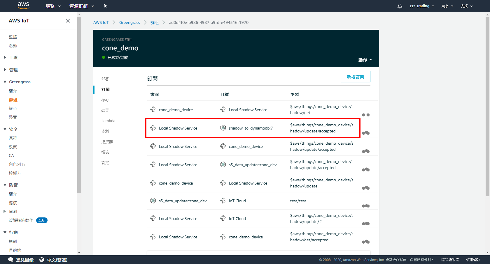
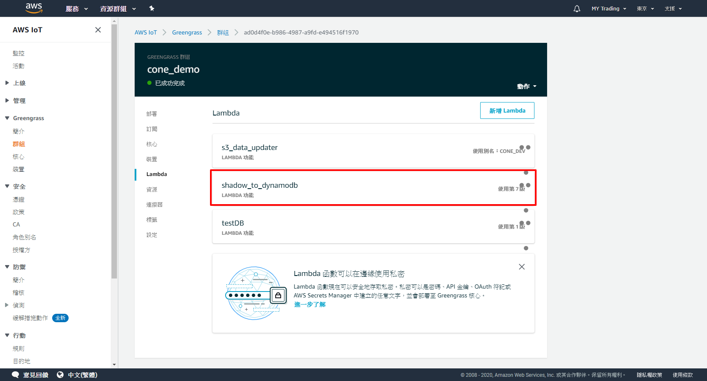
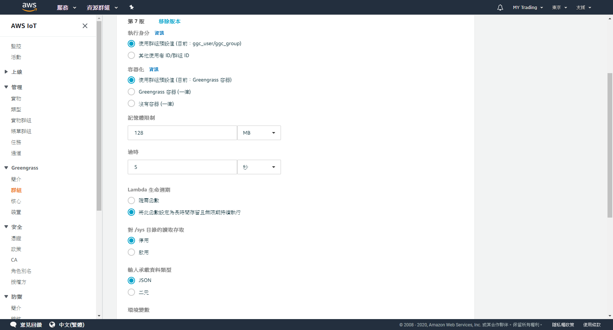
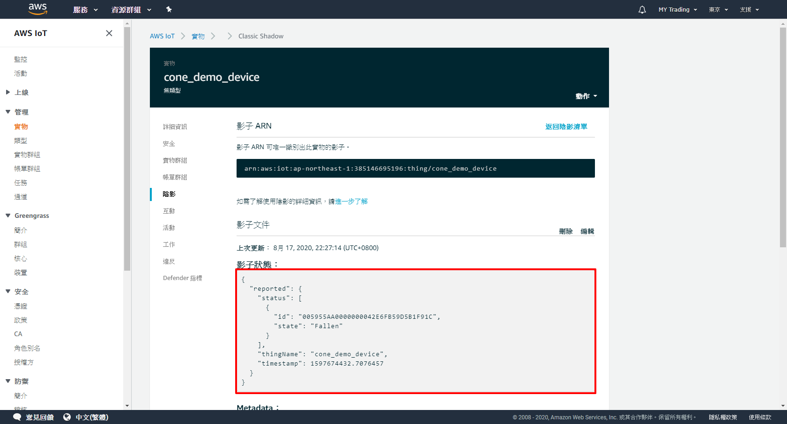
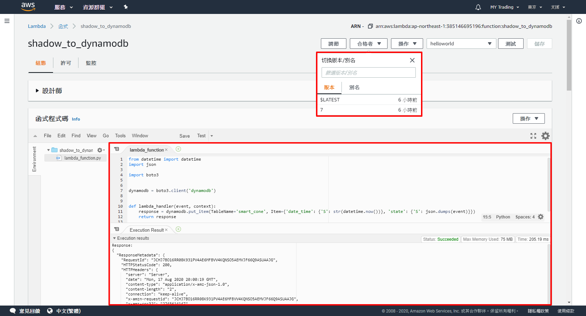
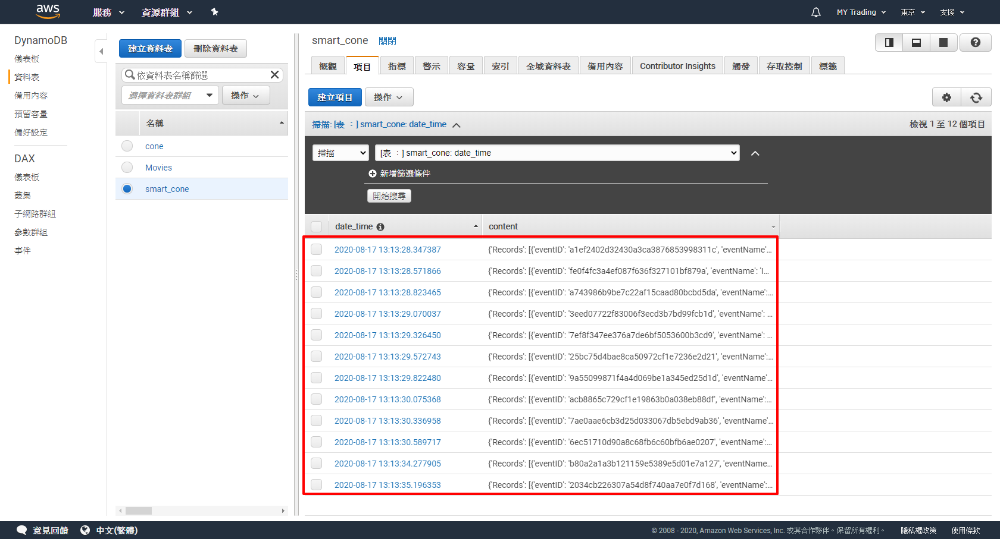
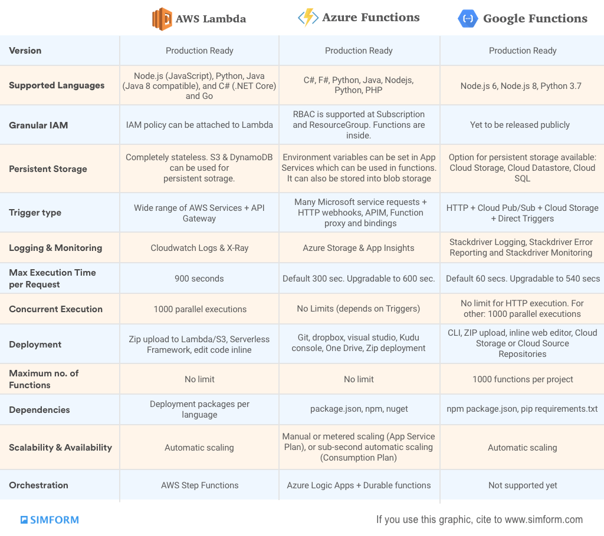

# Serverless Computing - AWS Lambda

([Source](https://medium.com/@psmanikandan/serverless-computing-c73f4ff45cc8))

## Serverless Computing
**Not** no servers, but **no need** to manage servers.

* Often known as **FaaS** (Function as a service)
  * AWS Lambda
  * Google Cloud Functions
  * Microsoft Azure Functions
* **Event-driven**
  * Trigger the functions only when needed.
* **Third-party services**
  * Like AWS Lambda, Google Cloud Functions, and Microsoft Azure Functions, etc.
* **Client-side logic**
  * Concentrate on our own business logic.
* **Cloud-hosted remote procedure calls**
  * Distributed computing (dedicated servers, virtual machines, or containers)

### Advantages
* **Cost**
  * Pay-as-you-go computing.
  * More cost-effective than renting or purchasing a fixed quantity of servers.
* **Scalability**
  * Developers and operators do not need to spend time setting up and tuning autoscaling policies or systems.
* **Productivity**
  * Simple event driven functions.
  * Programmers do not have to worry about multithreading or directly handling HTTP requests in their code, simplifying the task of back-end software development.

### Disadvantages
* **Performance**
  * Infrequently-used serverless code may suffer from greater response latency.
* **Resource limits**
  * Imposed by cloud providers.
* **Monitoring and debugging**
  * Profilers, debuggers or APM.
* **Security**
  * The total attack surface is significantly larger as there are many more components to the application compared to traditional architectures.
  * Customers cannot control and install anything on the endpoint and network level such as an intrusion detection/prevention system (IDS/IPS).
* **Privacy**
  * Based on proprietary public cloud environments.

## AWS Lambda

([Source](https://medium.com/@Whien/aws-lambda-serverless-with-slack-notification-%E6%89%8B%E6%8A%8A%E6%89%8B%E5%BB%BA%E7%AB%8B%E4%B8%80%E5%80%8B%E4%B8%8D%E9%9C%80%E8%A6%81%E7%B6%AD%E8%AD%B7%E4%BC%BA%E6%9C%8D%E5%99%A8%E7%9A%84-slack-%E8%A8%8A%E6%81%AF%E9%80%9A%E7%9F%A5-129918b299b5))

> AWS Lambda lets you run code without provisioning or managing servers. You pay only for the compute time you consume.

### Benefits
* No server management
* Flexible scaling
* Pay for value
* Automated high availability

### How it works

### Examples

#### Real-time file processing
> You can use Amazon S3 to trigger AWS Lambda to process data immediately after an upload. You can also connect to an existing Amazon EFS file system directly, which enables massively parallel shared access for large scale file processing. For example, you can use Lambda to thumbnail images, transcode videos, index files, process logs, validate content, and aggregate and filter data in real-time.

#### Smart Cone

##### AWS IoT

Subscribe

Lambda

Lambda Configurations

Shadow

##### AWS Lambda

##### AWS DynamoDB

## Comparison of Similar Cloud Services

([Source](https://www.simform.com/aws-lambda-vs-azure-functions-vs-google-functions/))

## References
* https://en.wikipedia.org/wiki/Serverless_computing
* https://en.wikipedia.org/wiki/Function_as_a_service
* https://medium.com/@jinghua.shih/serverless-faas-3b607f0158fe
* https://aws.amazon.com/lambda/
* https://aws.amazon.com/serverless/
