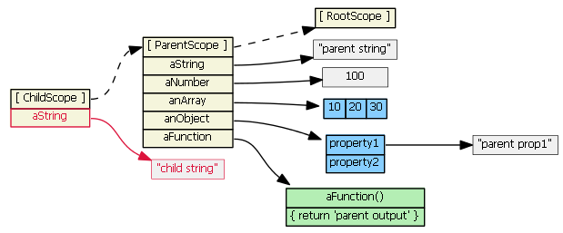

# Share information between components in AngularJS
在軟體開發中，可以將獨立的功能定成component，可以透過重複使用不同的component加速軟體開發過程。AngularJs中提供了幾種不同的方法在不同的component間共享資訊或構通

分成以下幾個topic解釋
* AngularJs component 
* DOM tree
* $scope inheritance
* Communication method

## AngularJs component 
Angularjs 通常是一個 view 對應一個controller，下圖為目前開發的connector library 以及他的controller
#### Connector library 畫面


#### Connectorlib Html view


#### Javascript ConnectorlibController


AngularJs透過$scope來讓 view和controller溝通，看一個簡單的例子


$scope.spice和{{spice}}對應的是同一個變數，在上面的view上chillSpicy()和$scope.chillSpicy對應同一個function，View和controller透過$scope來達成data-binding，在Angularjs中定義在controller中$scope內的內容，可以在View上直接使用

以上圖的toolbar為例，使用directive來產生component


在app.js中使用
```javascript
angular.directive('sbToolbar', SbToolbarDirective)
```
在view中可以使用


tb-data就是在上圖SbToolbarDirective中定義的
```javascript
scope:{
	'tbData': '=?'
}
```
將ConnectorlibController中的connectorLibTbData透過$scope傳給sb-toolbar，ConnectorlibController中會定義$scope.connectorLibTbData

## DOM tree

當網頁北載入時，瀏覽器會對應傳進來的html產生Document Object Model(DOM)，DOM會被建成一個類似tree的mode

#### 一個簡單的html範例


#### 結果


#### Dom tree
Dom tree可以表示html上element的parent–child relation


我們可以按照我們的view來建Dom tree

實際按照上圖建立Dom tree會變太複雜，我們可以只使用自訂的AngularJs component和網頁畫面建一個簡單的tree表示component之間的parent-child relation


Connectorlib中有使用到sb-toolbar、grid-views、connector-detail，所以connectorlib是sb-toolbar、grid-views、connector-detail的parent，connector-detail有用到sb-toolbar


## $scope inheritance
在使用component時會產生$scope來做data-binding，$scope會根據component的parent-child relation來繼承parent的內容

```javascript
childScope.aString === 'parent string'
childScope.anArray[1] === 20
childScope.anObject.property1 === 'parent prop1'
childScope.aFunction() === 'parent output'
```
因為繼承上述幾行的執行結果都會是true

執行
```javascript
childScope.aString = 'child string'
```
之後

上面的指令等於是在childScope中重新定義aString

執行
```javascript
childScope.anArray[1] = 22
childScope.anObject.property1 = 'child prop1'
```
之後

因為在childScope中未定義過anArray及anObject，所以parentScope中anArray和anObject會被修改

如果是執行
```javascript
childScope.anArray = [100, 555]
childScope.anObject = { name: 'Mark', country: 'USA' }
```
之後


對childScope中未定義的物件做修改則會修改到parentScope中的內容，如果是定義的話則會直接在childScope上修改
## communication method

### data-binding
在目前專案中很常使用directive來定義component，如前面範例可以針對scope做不同的設定，來決定component共享資料的方式

1. 	default (scope: false)
    
    使用的component不會新產生$scope，直接與parent共用$scope，沒有如前面一樣的繼承關係，對$scope中做的任何修改會影響到parent的$scope上。
    
    parent中的資料會很容易被component修改，可能狀況如parent中有一個變數與component中相同，但是programmer不知道component有使用該變數貿然使用該component就會發生在對component操作時parent被改動，而programmmer為預期到此現象的狀況發生。
2.  scope: true
    
    使用的component會新產生$scope，$scope的繼承如上面的topic所寫，childScope修改到parentScope狀況下降，但是還是有機會會修改到parent中的變數
3.  scope: { ... }(isolated scope)
    
    雖然前面幾點提到會修改到parent中變數的特性會讓開發難度提升，但是有好處，component中做了任何變化，不需要任何特別的操作就可以讓parent得到變化後的資料

    使用isolated scope可以得到data-binding的好處，而且可以讓$scope共用資料變得更清楚

    當scope:{}定為空，則component的$scope完全不與parent有任何關係，對component的任何操作不會影響到parent
    
    scope中可以定義要共享的變數，如前面舉例的toolbar。

    在sb-toolbar.directive.js中
    ```javascript
    function SbToolbarDirective(){
        return {
          restrict: 'EA',
            templateUrl: 'scripts/components/toolbar/sunbird-toolbar.html',
          controller: SbToolbarController, //'app.components.sbToolbarController',
          scope:{
            'tbData': '=?'
          }
        };
    }
    ```

    在connectorlib.html中
    ```html
    <sb-toolbar tb-data="connectorLibTbData" ng-show="vm.tabs[0].active === true"></sb-toolbar>
    ```
    在sb-toolbar中的$scope.tbData和connectorlib中的$scope.connectorLibTbData對應到相同資料上
    


#### html中

```html
<sb-panel
    panel-options="panelOptionsCd"
    panel-layout="panelLayoutCd"
    panel-data="connectorData"
    edit-mode="allowEdit">
</sb-panel>
```
panel中的$scope.panelData和connector-detail中的$scope.connectorData對應到相同資料上

針對panel上面的操作會改變panelData的資料也同時會改變connector-detail裡的資料，當connector-detail需要使用panel如save時就不需要再做額外操作
### custom event

舉實際使用案例

new button 是用來產生一個新的connector的 

點選下圖中的new button時

會call下面的function

```javascript
function newMenuClick(data){
    $scope.$emit("connectorDetailNewMenuClick");
}
```
如上$scope.$emit可以發送event，$emit是child發給parent的event由下往上，這個function是在connector-detail執行，所以這個event是由connector-detail發送的，發送給connnectorlib，在connnectorlib中

```javascript
$scope.$on("connectorDetailNewMenuClick", function(event, data){
    openNewTabForItem([null], true);
});
```
使用$scope.$on來接收event，接收event之後他會去call openNewTabForItem，這個function是用來產生新的tab的function，因為管理tab的工作是最外層的component connectorlib所以在connector-detail中點new button就必須向上發訊息給負責做產生tab這件事的component

## Conclusion
1. 使用data-binding可以讓資料在component間共享變得方便，但是必須使用isolated scope定義要公想的部分和不要共享的部分，避免無法預期的狀況並增加程式的維護性，如果在其他語言或框架則必須將component的input output定義清楚

2. event可以很好反應不同的操作，尤其是不會改變UI上資料的操作，但是不能將所有的操作定義成event來與其他component溝通否則程式會變得混亂

## reference

Dom tree [https://www.w3schools.com/js/js_htmldom.asp](https://www.w3schools.com/js/js_htmldom.asp)

when to broadcast[https://blog.steamulo.com/angularjs-when-to-broadcast-9be8bd6048e1](https://blog.steamulo.com/angularjs-when-to-broadcast-9be8bd6048e1)

Understanding-Scopes[https://github.com/angular/angular.js/wiki/Understanding-Scopes](https://github.com/angular/angular.js/wiki/Understanding-Scopes)

controller[https://docs.angularjs.org/guide/controller](https://docs.angularjs.org/guide/controller)
