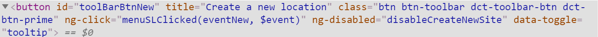

# **Simplify Locator In Robot Framework**

## Locating Elements

All keywords in SeleniumLibrary that need to interact with an element on a web page take an argument typically named `locator` that specifies how to find the element.

```
Click Element    xpath://*[@id='toolBarBtnNew']
```



### Explicit Locator Strategy

The explicit locator strategy is specified with a prefix using either syntax `strategy:value` or `strategy=value`.
 
```
Click Element    xpath://*[@id='toolBarBtnNew']
Click Element    xpath=//*[@id='toolBarBtnNew']
```

| Strategy | Match based on | Example |
| -------- | -------- | -------- |
| id     | Element id.     | id:example     |
| name     | name attribute.     | name:example     |
| identifier     |     Either id or name.     | identifier:example     |
| class     | Element class.     | class:example     |
| tag     |     Tag name.     | tag:div     |
| xpath     | XPath expression.     | xpath://div[@id="example"]     |
| css     | CSS selector.     | css:div#example     |
| dom     | DOM expression.     | dom:document.images[5]     |
| link     |     Exact text a link has.     | link:The example     |
| partial link     | Partial link text.     | partial link:he ex     |
| sizzle     | Sizzle selector provided by jQuery     | sizzle:div.example     |
| jquery     | Same as the above.     | jquery:div.example     |
| default     |     Keyword specific default behavior.     | default:example     |

Locator can be simplify by choosing the most accurate stratey.

```
Click Element    xpath://*[@id='toolBarBtnNew']
Click Element    xpath=//*[@id='toolBarBtnNew']
```

```
Click Element    identifier:toolBarBtnNew
Click Element    identifier=toolBarBtnNew
```

```
Click Element    id:toolBarBtnNew
Click Element    id=toolBarBtnNew
```

### Implicit XPath Strategy

If the locator starts with // or (//, the locator is considered to be an XPath expression.

```
Click Element    //*[@id='toolBarBtnNew']
Click Element    (//*[@id='toolBarBtnNew'])
```

### Default Locator Strategy

By default locators are considered to use the keyword specific default locator strategy. All keywords support finding elements based on `id` and `name` attributes.

```
Click Element    toolBarBtnNew
```

But some keywords support additional attributes or other values that make sense in their context.

| Keywords | Attributes |
| -------- | -------- |
| Click Button     | value     |
| Page Should Contain Button     | value     |
| Page Should Not Contain Button     | value     |
| Page Should Contain Radio Button     | value     |
| Page Should Not Contain Radio Button     | value     |
| Click Image     | src, alt     |
| Page Should Contain Image     | src, alt     |
| Page Should Not Contain Image     | src, alt     |
| Mouse Down On Image     | src, alt     |
| Click Link     | href, the link text     |
| Mouse Down On Link     | href, the link text     |
| Page Should Contain Link     | href, the link text     |
| Page Should Not Contain Link     | href, the link text     |

## Simplify Locator IN Test Case

### Example 1

```
### ORIGIN ###
Wait Until Field Management Page Is Visible
    Select Frame    ${fieldmgmtFrame}
    Wait Until Page Contains Element    xpath://*[@id='fieldmgmt-container']    timeout=${normalPeriodOfTime}    error=The fields management didn't appear after 10s.
    Wait Until Element Is Visible    xpath://*[@id='fieldmgmt-container']    timeout=${shortPeriodOfTime}    error=The fields management didn't display after 3s.
    Wait Until Page Contains Element    xpath://*[contains(@class, 'dct-page-top-nav')]    timeout=${normalPeriodOfTime}    error=The tabs in fields management page didn't appear after 10s.
    Wait Until Element Is Visible    xpath://*[contains(@class, 'dct-page-top-nav')]    timeout=${shortPeriodOfTime}    error=The tabs in fields management didn't display after 3s.
    Wait Until Page Contains Element    xpath://*[contains(@class, 'tab-content')]    timeout=${normalPeriodOfTime}    error=The tab content in fields management page didn't appear after 10s.
    Wait Until Element Is Visible    xpath://*[contains(@class, 'tab-content')]    timeout=${shortPeriodOfTime}    error=The tab content in fields management didn't display after 3s.
    [Teardown]    Unselect Frame

### SIMPLIFY ###
Wait Until Field Management Page Is Visible
    Select Frame    ${fieldmgmtFrame}
    Wait Until Page Contains Element    id:fieldmgmt-container    timeout=${normalPeriodOfTime}    error=The fields management didn't appear after 10s.
    Wait Until Element Is Visible    id:fieldmgmt-container    timeout=${shortPeriodOfTime}    error=The fields management didn't display after 3s.
    Wait Until Page Contains Element    class:dct-page-top-nav    timeout=${normalPeriodOfTime}    error=The tabs in fields management page didn't appear after 10s.
    Wait Until Element Is Visible    class:dct-page-top-nav    timeout=${shortPeriodOfTime}    error=The tabs in fields management didn't display after 3s.
    Wait Until Page Contains Element    class:tab-content    timeout=${normalPeriodOfTime}    error=The tab content in fields management page didn't appear after 10s.
    Wait Until Element Is Visible    class:tab-content    timeout=${shortPeriodOfTime}    error=The tab content in fields management didn't display after 3s.
    [Teardown]    Unselect Frame
```

### Example 2

```
*** Test Cases ***
TMD-5198-2 Verify the correct behavior of the combo-boxes
    [Tags]    Unknown-Failure
    Check The Representation Of The Input    Model
    Items List::Filter Items By Class    CRAC
    Pin Column Left    Class
    Items List::Filter Items By Mounting    Blade
    Verify Item List Is Empty

*** Keywords ***
### ORIGIN ###
Check The Representation Of The Input
    [Arguments]    ${columnName}
    Scroll Grid Until Column Is Visible    ${columnName}
    Select Frame After It Is Visible    ${assetsFrame}
    Wait Until Page Contains Element    xpath://*[text()='${columnName}']/../following-sibling::div[@ui-grid-filter]//input    timeout=${shortPeriodOfTime}
    Wait Until Element Is Visible    xpath://*[text()='${columnName}']/../following-sibling::div[@ui-grid-filter]//input    timeout=${shortPeriodOfTime}
    [Teardown]    Unselect Frame

### SIMPLIFY 1 ###
Check The Representation Of The Input
    [Arguments]    ${columnName}
    Scroll Grid Until Column Is Visible    ${columnName}
    Select Frame After It Is Visible    ${assetsFrame}
    Wait Until Page Contains Element    id:filter_cmbModel    timeout=${shortPeriodOfTime}
    Wait Until Element Is Visible    id:filter_cmbModel   timeout=${shortPeriodOfTime}
    [Teardown]    Unselect Frame

###  SIMPLIFY 2 ###
Check The Representation Of The Input
    [Arguments]    ${columnName}
    Scroll Grid Until Column Is Visible    ${columnName}
    Select Frame After It Is Visible    ${assetsFrame}
    Wait Until Page Contains Element    //*[text()='${columnName}']/../following-sibling::div[@ui-grid-filter]//input    timeout=${shortPeriodOfTime}
    Wait Until Element Is Visible    //*[text()='${columnName}']/../following-sibling::div[@ui-grid-filter]//input    timeout=${shortPeriodOfTime}
    [Teardown]    Unselect Frame
```

## Conclusion

Choose the suitable strategy to minimize the value while maintaining locator's **readability** and **reusability**.

## Reference

SeleniumLibrary [https://robotframework.org/SeleniumLibrary/SeleniumLibrary.html](https://robotframework.org/SeleniumLibrary/SeleniumLibrary.html)
