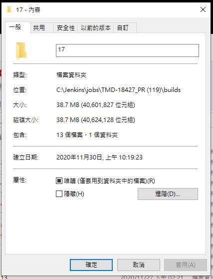
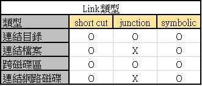
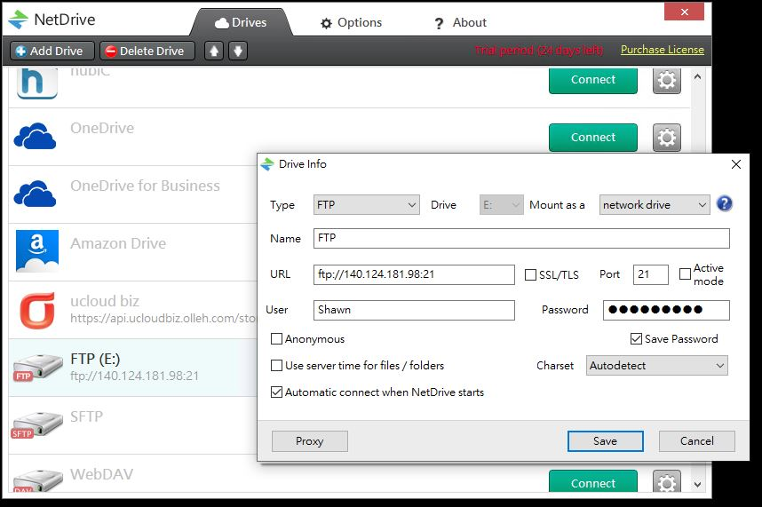
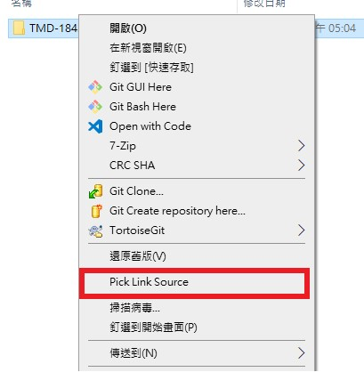
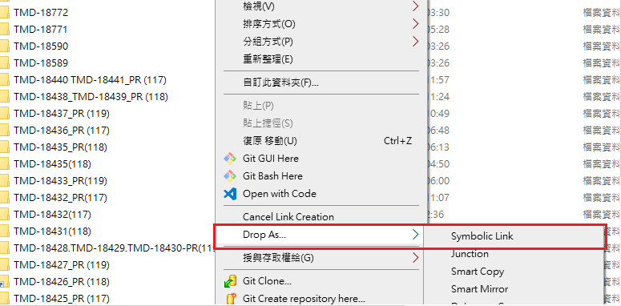
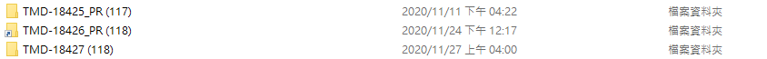

# Symbol Link
## 問題
為了能夠解決CI硬碟容量不足，需手動移置NAS，為了能直接移到NAS，並且可以繼續在CI上觀看報表，我使用Symbolic Link來接資料夾。
### CI容量不足造成的問題
- 需要人工手動搬進CI
- CI無法產生報表，造成時間浪費
### CI每次報表容量
每次產生的容量大約是38.7MB  

## Soft Link
### NTFS Junction
比較舊型的指向方式，用來將某個資料夾連結到不同的資料夾，像是將C:\Program Files做為D:\Program Files的進入點。限制是無法處理網路資料夾及檔案。

### Symbolic Link
更為先進的版本。它能用檔案連立進入點，而且沒有網路資料夾（SMB）的限制。
## Link比較

## Symbolic Link示意圖
 

## 實作
### NAS上設定
在NAS上開啟FTP  
  

### 在CI中使用Netdrive設定網路硬碟
在CI使用Netdrive將FTP掛載成網路硬碟  

### NAS檔案
我將要測試的檔案放褥NAS中  

### 安裝symbolic到CI
 
安裝後symbolic會出現在選單  
 
  
 
然後到想要要放資料的地方按drop as Symbolic Link   
 
  
 

### CI檔案
我將TMD-18426的Link放回原本CI中  

### CI中檔案路徑檔案
在檔案路徑中Link並不會影響檔案結構，讓檔案也能被CI讀取  

### CI畫面
再CI中畫面正常  

## ISSUE
- 當NAS關機或網路斷線時，CI將無法產生報表，也無法觀看

- 當CI重新啟動時，網路硬碟沒有及時連上，CI報表連結會有缺少

- 檢視報表時因為需經過網路讀取時間較久