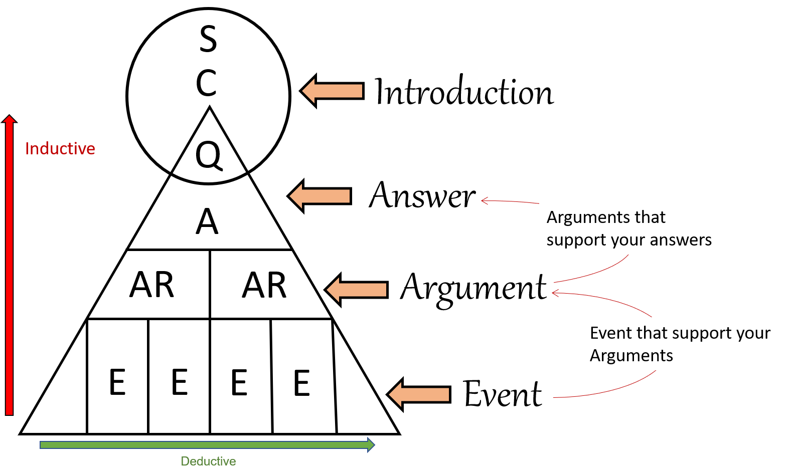
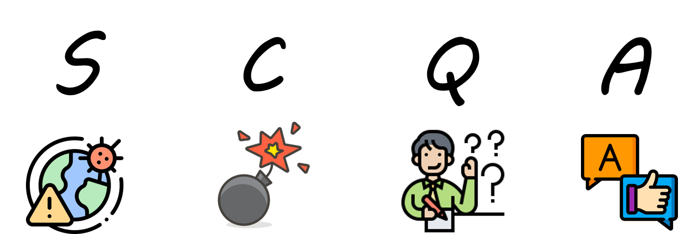
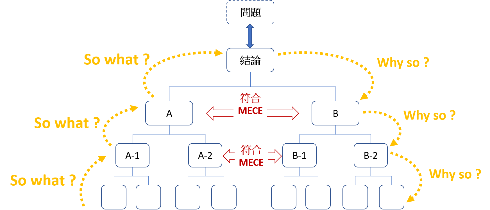
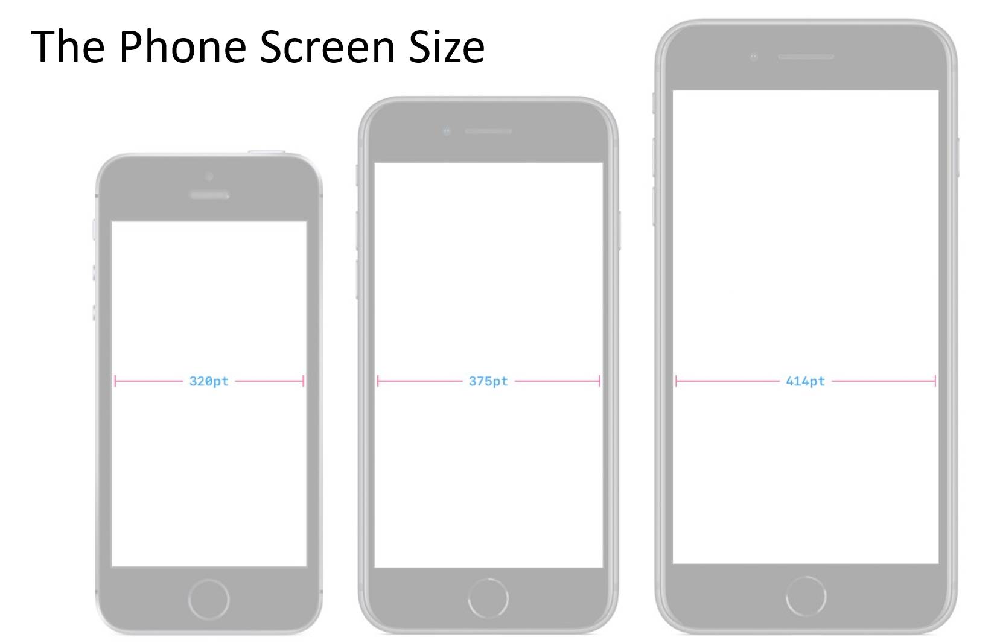
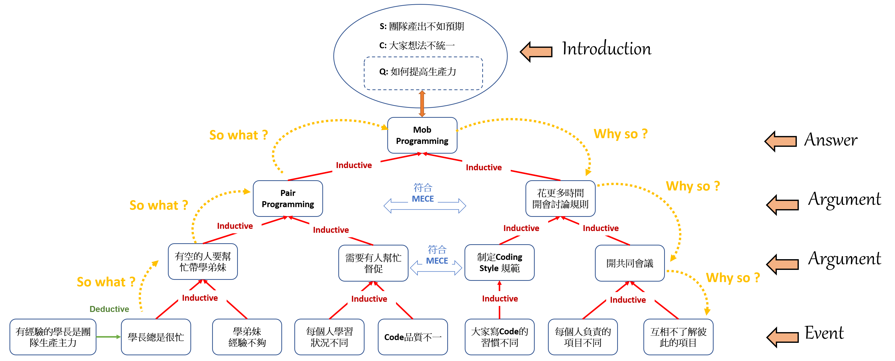

# The Minto Pyramid Principle

## SCQA Framework 

* **S，Situation**

* **C，Complication**

* **Q，Question**

* **A，Answer**

### Main principles

* **The part of any layer has been always `supporting the higher part`.**

* **Each set of part must always have the `same characteristics`.**

* **Each set of part must be organized in a logical sequence(`Deductive and Inductive`).**

* **MECE: cannot be omitted or overlapped.**

## MECE (Mutually Exclusive Collectively Exhaustive)

* **A framework for solving `complex business problems`**

* **The MECE principle support that to fix any `large problem`**

### 相互獨立(Mutually Exclusive) 

* **Small parts cannot overlap.**

* **Small elements  parallel each other**

### 完全不遺漏(Collectively Exhaustive) 

**If event `A` and event `B` are not omitted, then they satisfy:**

`A U B = S`

**The `S` refers to sample space**

## MECE Example : Smart Phone 

### Without MECE framework：

### MECE framework:

## How to build a pyramid Principle

1. **Put forward the `Theme idea`.**

2. **Write the `Introduction`.**

3. **The main `Question` of the member.**

4. **Repeat the question/answer for new questions from the member.**

## Logic of Problem-solving

**What we need first is to `define the problem` and `analyze the problem` before we can propose a solution.**

### Define the problem

#### 5W2H

1. `WHY`——為什麼？為什麼要這麼做？理由何在？原因是什麼？

2. `WHAT`——是什麼？目的是什麼？做什麼工作？

3. `WHO`——誰？由誰來承擔？誰來完成？誰負責？

4. `WHEN`——何時？什麼時間完成？什麼時機最適宜？

5. `WHERE`——何處？在哪裡做？從哪裡入手？

6. `HOW`——怎麼做？如何提高效率？如何實施？方法怎樣？

7. `HOW MUCH`——多少？做到什麼程度？數量如何？質量水平如何？費用產出如何？

### Analyze the problem

#### Analyze the problem for 4 steps

* **Collect information** (收集訊息)

* **Describe the findings** (描述發現)

* **Draw conclusions** (得出結論)

* **Propose solutions** (提出解決方案)

## Conclusion

**我們可以利用金字塔原則，改善溝通的效率，以及有邏輯性的解決遇到的問題以及困難。**

## Reference

_Book_: [The Minto Pyramid Principle: Logic in Writing, Thinking, & Problem Solving](https://www.amazon.com/Minto-Pyramid-Principle-Writing-Thinking/dp/0960191038)

_Wiki_: [MECE](https://zh.wikipedia.org/wiki/MECE%E5%8E%9F%E5%88%99)

_Src_: [Framework No. 13: The Pyramid Principle](webhttps://medium.com/frameworks-to-live-by/framework-no-13-the-pyramid-principle-df20bbeeadd4)

_Video_: [THANK YOU, BARBARA MINTO](https://www.harrisonmetal.com/library/storytelling-amp-presenting-1-thank-you-barbara-minto)