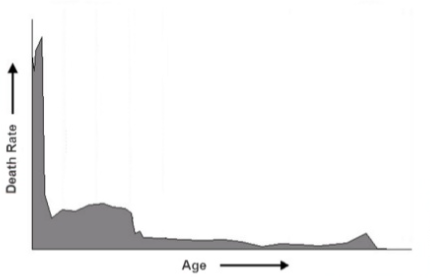

# Garbage Collection In Java

## 為什麼要了解Java的垃圾回收機制?
Java是一個大家耳熟能詳且應用領域很廣的程式語言，除了廣泛應用於金融服務業外，網頁後端、遊戲乃至手機APP都可以看到它的蹤影。雖然常用，但Java反應速度慢與資源使用量多是很多人詬病的問題，而垃圾回收機制在這兩個效能指標內便扮演著重要的角色。透過理解GC可以讓你為不同的平台以及程式選擇最適合的回收機制，以發揮更好的效能。

## GC(garbage collection, 垃圾回收)是什麼？
Java的物件不用手動解構這點寫過的人都知道，那麼Java是使用何種方式來解構物件的？答案便是GC。GC可以說是一個主動式的物件解構機制，透過從[GC Roots](https://help.eclipse.org/2020-12/index.jsp?topic=%2Forg.eclipse.mat.ui.help%2Fconcepts%2Fgcroots.html&cp=37_2_3)為起點遍歷各個物件並將不再使用的物件清除，達到回收物件、釋放空間的效果。

## Generational Garbage Collection
首先要介紹的是Generational GC。它是一種執行GC的邏輯方法，也是G1GC之前所有garbage collector的理論基礎，即使到G1GC上也仍能看到它的影子。

#### Garbage Distribution [1]

此種方法的主要前提為:
* 假設大部份物件在 new 出來後很快就沒用了
* 主力回收新出生的物件
* 偶而檢查剩下的物件

名詞解釋:

**STW**: stop-the-world，為了執行GC而使應用程式暫停執行的時間。

**young Generation**: 新建立的物件大多存於此區，因上述的前提，大多數物件在此區建立後沒多久便會被解構，我們稱此解構為**minor GC**。

**old generation**: 當物件經歷一定次數的minor GC而沒有被解構時，便會將其從young Generation移動到此區，以避免進行minor GC時頻繁移動它造成額外開銷以及空間浪費。解構此區物件則稱為**major GC**(即full GC)。另外，如果新建立的物件過大時，物件會直接放進此區中。

**permanent generation**: 儲存類別、字串等內容的地方，不會有物件從其它generation移動到這裡。此區的GC亦屬於major GC。

其中young Generation被分為三個區塊，分別是一個Eden以及兩個survivor space；而old generation則只有Tenured一個區塊。

### GC執行步驟
1. 新建立的物件會被放入Eden中

#### Object Allocation [2]

2. 當Eden放不下時即會啟動minor GC，首先標記物件的reference狀態以後，將Eden以及survivor space中仍有被使用的物件移動至另一個survivor space，並清空Eden以及原本的survivor space。物件上的數字為經歷GC的次數。

#### minor GC [2]

3. 當物件經歷GC的次數超過一定值時便會被移動到Tenured區，即old generation。圖中以8次為範例。

#### promotion [2]

4. 當Tenured區滿時會觸發major GC，將Tenured區中沒有用到的物件清除。而通常Tenured裡的物件數量、大小比起Eden和survivor要大的多，因此執行起來會有比較長的STW，Java程式中明顯的卡頓感很多時候是來自此處。

## Garbage Collectors based on Generational GC
1. Serial GC(-XX:+UseSerialGC): 不管是young還是old generation都利用單一thread進行GC。

#### serial gc [3]

2. Parallel GC(-XX:+UseParallelGC): young generation使用多個thread而old generation則使用單一thread進行GC。(Java4)
3. Parallel Old GC(-XX:+UseParallelOldGC): 不管是young還是old generation都利用多個thread進行GC。(Java6)
4. Concurrent Mark & Sweep GC (-XX:+UseConcMarkSweepGC): young generation使用多個thread處理，而old generation則使用CMS(Concurrent Mark & Sweep)方式處理。
pa
**CMS**:

首先利用initial mark標記GC Root，之後在應用程式同步執行時遍歷reference並標記(Concurrent Mark)，遍歷完後再檢查並標記同步的這段時間內新增的reference(Remark)，最後與應用程式同步執行清除。

#### cms [3]

參數設定相關說明:

1. Parallel GC以及Parallel Old GC可以利用-XX:MaxGCPauseMillis設定最大STW時間，並且可以用-XX:GCTimeRatio設定垃圾回收與總時間佔比。
2. #### Generational GC 空間設定參數 [9]
    

### Garbage-First GC(G1GC)(–XX:+UseG1GC)
為了改善CMS的heap fragmentation並進一步減少STW，G1GC使用了新的heap規劃方式。G1GC將heap劃分為大小相等(1~32MB，2的指數次)且連續的一個個region，並且每個region會分別對應到Eden、Survivor、Old、Humongous四種角色之一，並且每次執行GC時都是以一個region為單位進行。

#### heap規劃示意圖 [4]

主要目的與策略:

* 讓STW可控(預設落在200ms，調低將更頻繁觸發GC)
* 在Generational GC的前提下盡可能多做young generation GC
* 有需要時抽空順便處理一些 old generation GC (mixed GC)

G1GC有兩種GC模式:

1. young GC: 有點類似Generational GC中的minor GC，將Eden以及survivor中仍被使用的物件轉移到新的survivor中。優先挑選物件較少的region。

#### young GC [4]

2. mixed GC: 在此階段可能會同時處理young和old generation，因此被稱為mixed GC。分為五個階段: Initial Mark(STW) -> Root Region Scan -> Cocurrent Marking -> Remark(STW) -> Copying/Cleanup(STW/Concurrent)
    1. Initial Mark(STW) & Root Region Scan: 標記配置的空間

    #### Initial Mark [4]
    

    2. Cocurrent Marking: 將本來就沒有存活物件的region直接刪除

    #### Cocurrent Marking [4]
    

    3. Remark(STW): 重新標記配置的空間

    #### Remark [4]
    

    4. Copying/Cleanup(STW/Concurrent): 將還存活的young和old generation的物件分別複製到新的空間，並清除原本的region。

    #### Copying/Cleanup [4]
    
    
    
G1GC的thread執行示意圖

#### G1GC Collector excution [1]

參數設定相關說明:
請參考[Garbage First Garbage Collector Tuning - Oracle](https://www.oracle.com/technical-resources/articles/java/g1gc.html)

### 比較
|                    | 優點 | 缺點 | 適用場合 |
| --------           | -------- | -------- | -------- |
|UseSerialGC         | 簡單、效能使用率高、不用Context Switch | STW較長 | 單核心、heap較小、不要求反應時間之系統 |
|UseParallelGC       | STW較短、可控制吞吐量 | Context Switch、少核心系統表現不如Serial | 多核心系統(4或以上)、要求反應時間之系統 |
|UseParallelOldGC    | 同上 | 同上 | 同上 |
|UseConcMarkSweepGC  | STW非常短 | many heap fragmentation、CPU效能要求較高 | 需較短反應時間之系統、多核心且CPU效能較佳的系統 |
|UseG1GC| STW非常短且可控、避免fragmentation | 複雜、因使用大量copy並且使用較大的分割(region)，需求較大heap | heap較大(4G或以上)、多核心系統、需較短反應時間之系統|

## The Z Garbage Collector(ZGC)(-XX:+UseZGC)
* Concurrent GC
* 訴求為STW<10ms(實際使用通常更短)
* Java 15 開始，ZGC 已可在產品中使用

ZGC完全放棄了young、old generation的設計，利用著色指標、Load Barrier等複雜的技術，讓除了標記GC Roots以外的幾乎所有工作都能concurrent的執行，是目前性能最好的Garbage Collector。

**著色指標**: 一種將資訊儲存在指標中的技術，ZGC實際使用64位元中的0-41位，並且將42-45位拿來儲存資料。

**Load Barrier**: 在讀取物件指標時，如果目標物件正在移動，著色指標上的資料就會被修改。ZGC發現後會先把reference更新到正確的位址，然後再回傳所需之物件。透過此方法雖然會使讀取物件指標變得不直接、需額外開銷，但可以避免heap STW。

參考資料:

[1] https://www.slideshare.net/leonjchen/java-gc-javadeveloperdaytw

[2] https://www.oracle.com/webfolder/technetwork/tutorials/obe/java/gc01/index.html

[3] https://www.alexleo.click/java-%E5%96%9D%E6%9D%AF%E5%92%96%E5%95%A1%EF%BC%8C%E8%81%8A%E9%BB%9E-gc%EF%BC%88%E4%B8%80%EF%BC%89-%E5%9F%BA%E7%A4%8E%E6%A6%82%E5%BF%B5/

[4] https://www.infoq.cn/article/3wyretkqrhivtw4frmr3

[5] https://help.eclipse.org/2020-12/index.jsp?topic=%2Forg.eclipse.mat.ui.help%2Fconcepts%2Fgcroots.html&cp=37_2_3

[6] https://medium.com/fcamels-notes/java-garbage-collection-%E7%B0%A1%E4%BB%8B-c52e5c5dbd55

[7] https://blog.csdn.net/wan_guo_shi/article/details/102816173

[8] https://iter01.com/521149.html

[9] https://help.sap.com/saphelp_nw73/helpdata/en/f0/cec51dabd1461b87e4db9e3958710e/content.htm?no_cache=true

[10] https://www.oracle.com/technical-resources/articles/java/g1gc.html