# Kubernetes

## Agenda
- [What is Kubernetes](#what-is-kubernetes)
- [Basic Architecture](#basic-architecture)
- [Common Resource Objects](#common-resource-objects)
- [Example](#example)
- [References](#references)


## What is Kubernetes
Kubernetes is a open-source platform for deploying and running containerized
applications and services with high scalability and maintainability. For
simplicity, we also call it k8s. (replace letters "`ubernete`" with a digit `8`)


## Basic Architecture
In k8s, a **cluster** is a basic unit for developers to run workloads and 
deploy application.

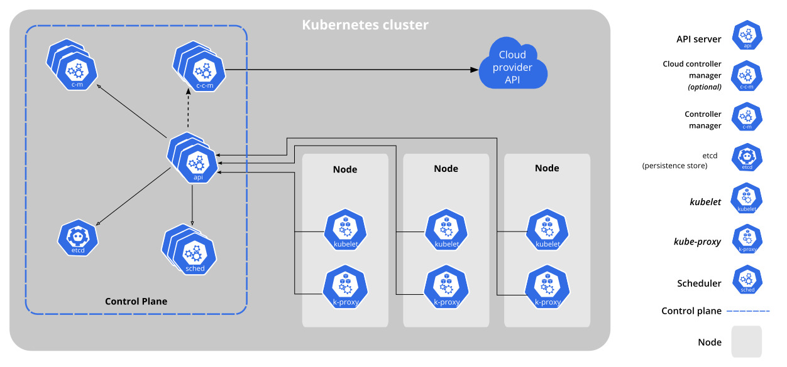

- Control Plane

  - API server

    The core of the k8s cluster. API server provide the communication interface
    (RESTful) for every other components in this cluster, including receiving
    messages sent from nodes, dispatch missions to scheduler or store data into 
    etcd.

  - etcd

    etcd is a **distributed** key-value storage, which is used as the backing
    store for the whole cluster. Just like we have discussed in **Distributed
    System**, it implemented some consensus algorithm (Raft) to solve the 
    synchronization problems.

  - kube-scheduler

    kube-scheduler is responsible for assign a newly-created Pods to a Node.
    The factors below will be taken into account when making scheduling
    decisions:
    - resource requirement
    - hardware/software constraints
    - data locality

  - kube-controller-manager

    kube-controller-manager is a component that runs controllers. Here are some
    types of controllers:

    - Node controller
      
      monitor the status of each node in cluster.

    - Jobs controller

      allocate Node and create Pods to run Job.

- Node

  - kubelet

    kubelet is installed on each Node. It is responsible for communicating
    with API server and managing containers and Pods running on this Node.

  - kube-proxy

    kube-proxy maintains network rules on Node; otherwise, it also maintains an
    iptable, providing ways for Service to find corresponding Pods. 

  - container runtime

    The container runtime is responsible for running containers. k8s support the
    following container runtime:

    - Docker

    - containerd

    - CRI-O


## Common Resource Objects

### Pod

Pods is a smallest unit in k8s. A pod is a group of one or more containers with
shared storage and network resources. Typically, we will put more than one 
containers in one Pod only when they are relatively tightly coupled.

`pod.yaml`
```yaml
apiVersion: v1                         # k8s api version
kind: Pod                              # resource type
metadata:
  name: my-pod                         # Pod name
spec:
  containers:
  - name: my-container                 # container name
    image: nginx                       # used image (default from DockerHub)
    ports:                             # expose port
      - containerPort: 80
```

```bash
$ kubectl apply -f pod.yaml

pod/my-pod created
```

the example above creates a Pod directly, just like we run a container with docker. But this is NOT recommended to create a Pod, as Pod is designed as a
ephemeral and disposable entities.

### Deployment

Instead of create a Pod directly, we often create a Deployment to manage a group
of Pods.

Deployment is a resource object that helps us to manage replicated Pods. After
creating a Deployment, a ReplicaSet is also create and it will automatically
create a group of Pods (defined in yaml file).

If one of the replica crashed, other replica will take over its work.

Deployment will find Pod through the **selector**, any Pods with label matching
the selector label will be managed by the Deployment.

`deployment.yaml`
```yaml
apiVersion: apps/v1                    # api version
kind: Deployment                       # resource type
metadata:
  name: my-deployment                  # deployment name
spec:
  replicas: 2                          # define the number of replica
  selector:                            # define selector to find Pod
    matchLabels:                       # must match the labels in the following
      app: my-nuxt                     # template
  template:                            # define Pod
    metadata:
      labels:                          # Pod's label
        app: my-nuxt
    spec:
      containers:                      # define container running in the Pod
      - name: my-container             # Pod can contain more than one container
        image: mashu6211/my-nuxt
        ports:
        - containerPort: 80
```

```bash
$ kubectl apply -f deployment.yaml

deployment.apps/my-deployment created
```

#### Comparison between Deployment and ReplicaSet

They will select Pods through selector defined in the yaml file, but the
differences are:

Deployment:
- A stronger resource object to manage multiple Pods
- When creating a Deployment, an ReplicaSet will be automatically generated.

ReplicaSet:
- An older resource object to manage multiple Pods

### Service

A Service helps us to expose an application running on Pods to either **internal
application** in the same cluster or **external application** in other cluster,
in this way, other applications can access the target Pod through the Service
instead of access the Pod directly.

In k8s, Service is an abstraction that defines a logical set of Pods to expose.
Same as Deployment, Service will select target Pods through selector.

`service.yaml`
```yaml
apiVersion: v1                         # api version
kind: Service                          # resource type
metadata:
  name: my-service                     # service name
spec:
  selector:                            # define selector to find Pod
    app: my-nuxt                
  ports:
  - port: 80                           # the port for client to access
    targetPort: 80                     # the port that app listen on
    protocol: TCP
```

```bash
$ kubectl apply -f service.yaml

service/nuxt-service created
```

There are 2 major different types of Service:

- ClusterIP

  expose application for other apps IN the cluster

  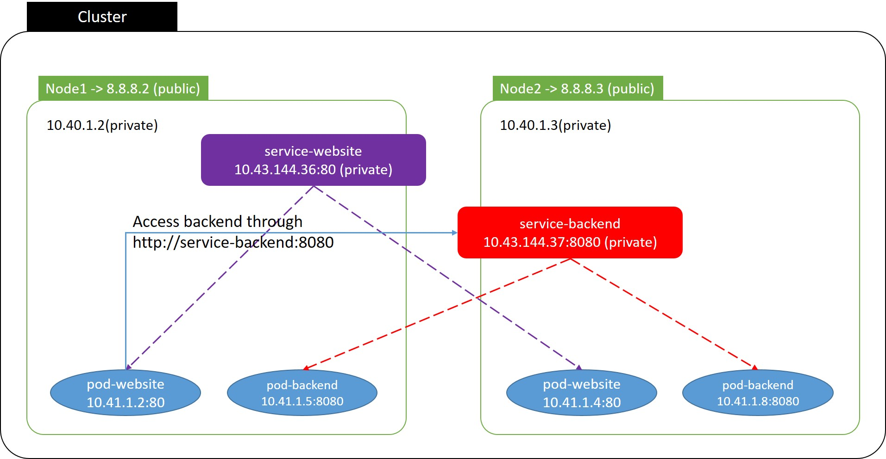

- NodePort

  expose application for other apps OUT of the cluster

  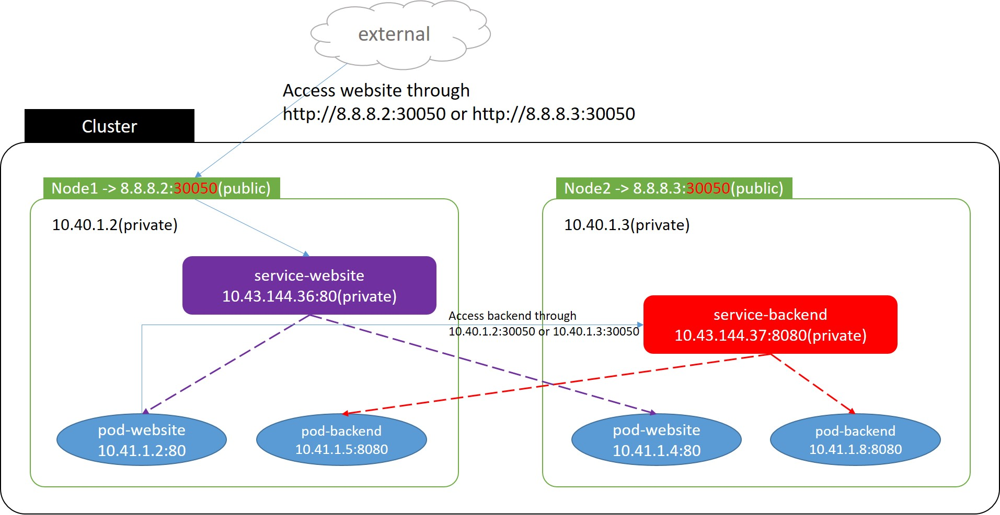


### Ingress

Although we can access application through a Service with type NodePort, but as
the growth of your app, the management of the port number will be a disaster.

This is why Ingress was introduced.

Ingress exposes HTTP and HTTPS routes from outside the cluster to services
within the cluster. It send traffic to specific Service according to the rules
defined in the yaml file.

`ingress.yaml`
```yaml
apiVersion: networking.k8s.io/v1
kind: Ingress
metadata:
  name: my-ingress
spec:
  rules:
  - host: nginx.mashu.idv.tw
    http:
      paths:
      - path: /
        pathType: Prefix
        backend:
          service:
            name: nginx-service
            port:
              number: 80
  - host: me.mashu.idv.tw
    http:
      paths:
      - path: /
        pathType: Prefix
        backend:
          service:
            name: my-service
            port:
              number: 80
```

```bash
$ kubectl apply -f ingress.yaml

ingress/my-ingress created
```

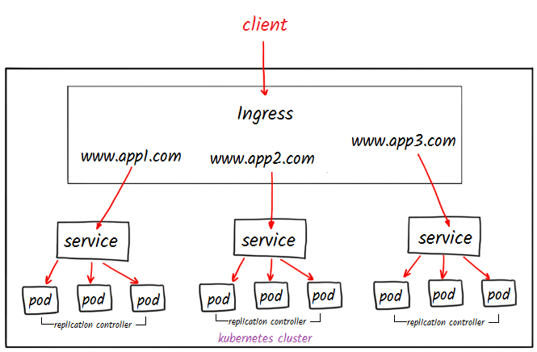

an Ingress works only when you have deployed **Ingress Controller**. Unlike
other types of controllers which run as part of the kube-controller-manager
binary, Ingress controllers are not started automatically with a cluster.

## Example

There are some tools for us to practice k8s:
- minikube
- kubeadm
- k3d

`minikube` and `kubeadm` require more ram and cpu, so I prefer `k3d`.

`k3d` is a light-weight wrapper to run an minimal Kubernetes distribution in
docker.

create cluster using k3d

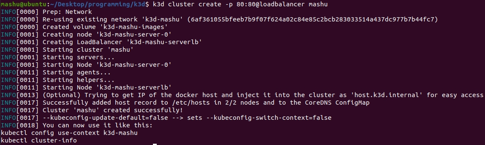

check cluster in a container

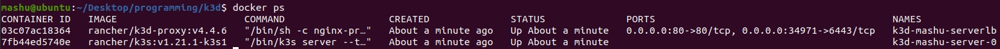

create an app (website)

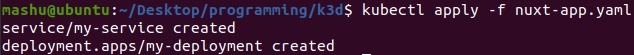

```yaml
apiVersion: v1
kind: Service
metadata:
  name: my-service
spec:
  selector:
    app: my-nuxt
  ports:
  - port: 80
    targetPort: 80
    protocol: TCP

---

apiVersion: apps/v1
kind: Deployment
metadata:
  name: my-deployment
spec:
  selector:
    matchLabels:
      app: my-nuxt
  template:
    metadata:
      labels:
        app: my-nuxt
    spec:
      containers:
      - name: my-container
        image: mashu6211/my-nuxt
        ports:
        - containerPort: 80
        resources:
          limits:
            memory: "128Mi"
            cpu: "500m"
```

creating

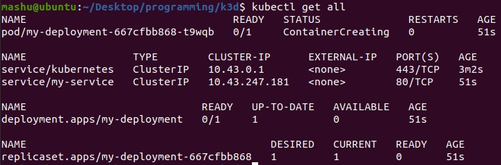

created

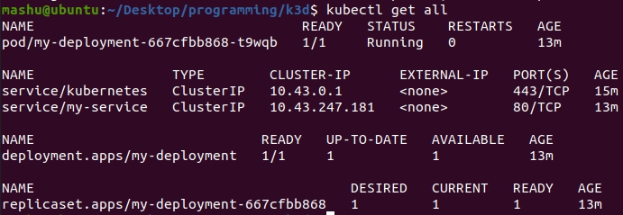

create an ingress

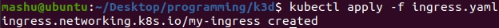

```yaml
apiVersion: networking.k8s.io/v1
kind: Ingress
metadata:
  name: my-ingress
spec:
  rules:
  - host: nginx.mashu.idv.tw
    http:
      paths:
      - path: /
        pathType: Prefix
        backend:
          service:
            name: nginx
            port:
              number: 80
  - host: drone.mashu.idv.tw
    http:
      paths:
      - path: /
        pathType: Prefix
        backend:
          service:
            name: drone-service
            port:
              number: 80
  - host: me.mashu.idv.tw
    http:
      paths:
      - path: /
        pathType: Prefix
        backend:
          service:
            name: my-service
            port:
              number: 80
```

inspect details of ingress

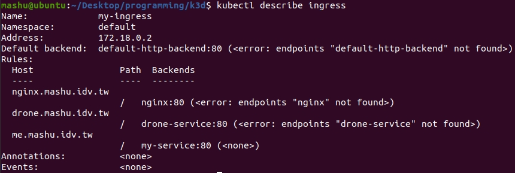

local dns setting at `/etc/hosts`

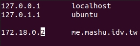

result

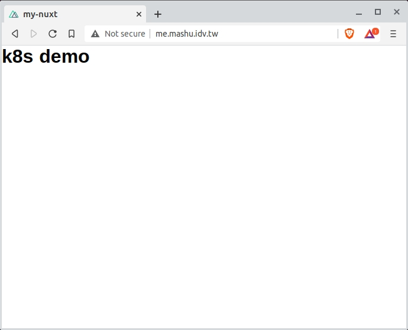


## References

[Kubernetes official docs](https://kubernetes.io/docs/home/)