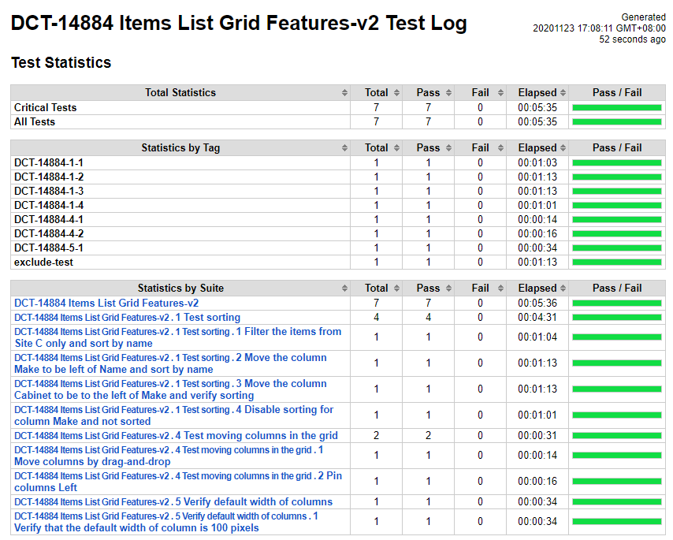
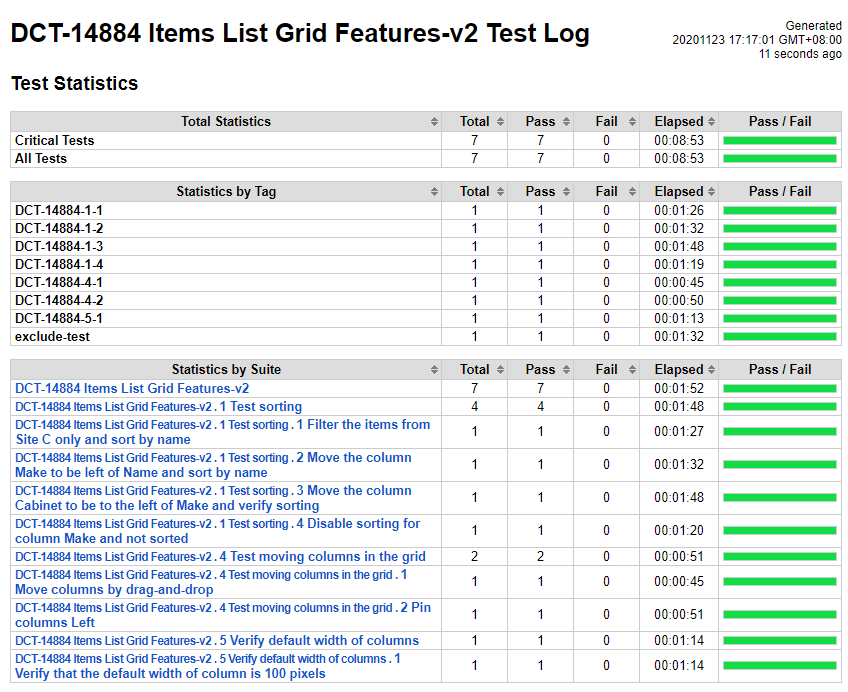
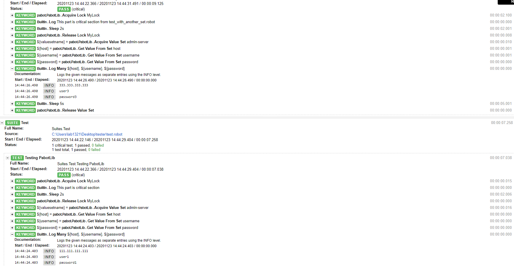
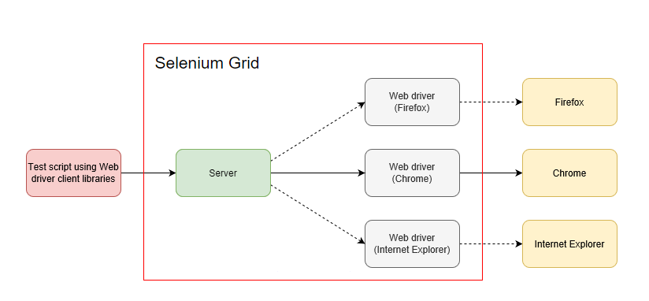

# **Parallel Testing In Robot Framework Using Pabot**

<br>

## ``What is Pabot:``

Pabot is a parallel executor for Robot Framework tests. Split one execution into multiple and save test execution time.

<br>

``Without Pabot``


``With Pabot``


<br>

<br>
<br>

## ``How do we customize the test order?``
---
### ``.pabotsuitenames``

```
datasources:ef12d7fb944abc4d59987c47d2aab7050e827340
commandlineoptions:46ee2bbfad4752315fe28d9b2bfcd3cd406345ba
suitesfrom:no-suites-from-option
file:a16219fdc14d1edca695e5ecd1bd76de12538387
--suite DCT-14884 Items List Grid Features-v2.1 Test sorting.1 Filter the items from Site C only and sort by name
--suite DCT-14884 Items List Grid Features-v2.1 Test sorting.2 Move the column Make to be left of Name and sort by name
--suite DCT-14884 Items List Grid Features-v2.1 Test sorting.3 Move the column Cabinet to be to the left of Make and verify sorting
--suite DCT-14884 Items List Grid Features-v2.1 Test sorting.4 Disable sorting for column Make and not sorted
--suite DCT-14884 Items List Grid Features-v2.4 Test moving columns in the grid.1 Move columns by drag-and-drop
--suite DCT-14884 Items List Grid Features-v2.4 Test moving columns in the grid.2 Pin columns Left
--suite DCT-14884 Items List Grid Features-v2.5 Verify default width of columns.1 Verify that the default width of column is 100 pixels
```

- ``The order of suites can be changed.``
- ``If a directory (or a directory structure) should be executed sequentially, add the directory suite name to a row.``
- ``You can add a line with text #WAIT to force executor to wait until all previous suites have been executed.``
- ``You can group suites and tests together to same executor process by adding line { before the group and } after.``
***
- ``add`` <i>--ordering FILENAME</i> ``into command``

<br>
<br>

## ``How do we prevent race condition?``

---

## ``Pabot Library:``

PabotLib helps in parallel execution with pabot, PabotLib contains 4 types of keywords:

| | | | | |
-|:-|:-|:-|-
<b>``Execution affecting keywords``        | Run Setup Only Once | Run Teardown Only Once | Run Only Once | Run On Last Process |
<b>``Value transfer between processes``    | Set Parallel Value For Key | Get Parallel Value For Key |
<b>``Using a shared resource``             | Acquire Value Set | Get Value From Set | Release Value Set | Disable Value Set |
<b>``Locks``                               | Acquire Lock | Release Lock | Release Locks |
| | | | | |

<br>

### ``test.robot``
```
*** Settings ***
Library    pabot.PabotLib
  
*** Test Case ***
Testing PabotLib
    Acquire Lock   MyLock
    Log   This part is critical section
    Sleep    2s
    Release Lock   MyLock
    ${valuesetname} =    Acquire Value Set  admin-server
    ${host} =   Get Value From Set   host
    ${username} =     Get Value From Set   username
    ${password} =     Get Value From Set   password
    Log Many  ${host}  ${username}  ${password}
    Sleep   5s
    Release Value Set
```

### ``test_with_another_set.robot``
```
*** Settings ***
Library    pabot.PabotLib
  
*** Test Case ***
Testing PabotLib
    Acquire Lock   MyLock
    Log   This part is critical section from test_with_another_set.robot
    Sleep    2s
    Release Lock   MyLock
    ${valuesetname} =    Acquire Value Set  admin-server
    ${host} =   Get Value From Set   host
    ${username} =     Get Value From Set   username
    ${password} =     Get Value From Set   password
    Log Many  ${host}  ${username}  ${password}
    Sleep   5s
    Release Value Set
```

### ``valueset.dat``
```
[Server1]
tags=admin-server
HOST=111.111.111.111
USERNAME=user1
PASSWORD=password1
  
[Server2]
tags=server
HOST=222.222.222.222
USERNAME=user2
PASSWORD=password2

[Server3]
tags=admin-server
HOST=333.333.333.333
USERNAME=user3
PASSWORD=password3
```

### ``Command``
```
pabot --pabotlib --resourcefile valueset.dat test.robot test_with_another_set.robot
```

<br>



<br>
<br>
<br>

---

## ``How do we overcome the limitations of hardware devices such as CPU, Memory?``

---

<br>




<br>

## ``How we going to use it:``

 - <i> Apply remote webdriver in test cases
 -  Setup Selenium Grid environment
 -  Run all test in parallel using Pabot </i>

<br>

## ``Issues``

- <i> Console log is not clearly as before

- We should gaurantee that each test case is independent

- Server should be able to afford the requests

## ``Conclusion``

Pros: Parallel testing in various OS or browser on remote machine.

Cons: Hub and Node need to be taken care of, hardware devices should be noticed.