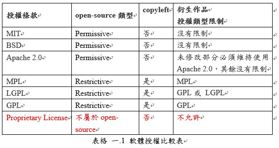

# 軟體授權

## 自由與授權軟體
### 自由軟體(free software)
- 不一定是免費軟體(freeware)
- 可販賣軟體或提供商業服務
- 是關乎自由，與價格無關
- 使用者必須能夠自由地在任何時間散布該軟體的原版或是覆寫版，在任何地方給任何人使用。

### 開源軟體
- 原始碼可任意取用
- 多數開源軟體也是自由軟體
- 開源但不自由，例如: Open Watcom C/C++ compiler(Sybase Open Watcom Public License)

## 授權方式
### Proprietary Licensing
- 以保護持有者的智慧財產權為目的，因此對於使用者有較多的限制，常會需要收費，並且只能直接使用軟體成品；欲取得軟體的原始碼及修改權利，則通常需要額外付費。
- 例如: Microsoft Windows, Adobe Flash Player, Adobe Photoshop, Google Earth

### Free and Open Source Software Licensing(FOSS)
- 對商業使用較於友善的授權，雖然會有些差異，但基本上此類的授權可以自由的使用、修改及發佈，不受使用目的的限制。

### Hybrid Licensing
- 混合前面兩種授權方式的雙授權或多授權軟體，通常情況下使用者在使用的時候可以享有 FOSS 的自由，但僅限於使用基本功能；使用者可以藉由購買付費版本取得更多的功能。至於修改或重新發佈，Hybrid Licensing通常採Proprietary Licensing實施。
- 例如: Oracle MySQL，額外付費的Enterprise Edition相較於免費的版本具有較高的穩定性及安全性

## 常見授權條款
- Copyleft: 其概念源自於自由軟體運動，並不代表放棄著作權，而是一種基於現有的著作權體制，保障使用者軟體自由使用權利的授權方式。在自由軟體的授權條款中增加Copyleft條款之後，其他使用者便有權可以自由地使用、修改和發佈，其修改後的衍生作品同樣需要簽署Copyleft授權條款。
- Permissive: 授權條款允許但不強制要求公開衍生作品的原始碼。
- Restrictive: 授權條款強制要求公開衍生作品的原始碼。

### MIT
- 使用者有權利使用、複製、修改、合併、出版發行、散布、再授權和/或販售軟體及軟體的副本，但需要在軟體和軟體的所有副本中都必須包含著作權聲明和本許可聲明。
- 可以不用公開原始碼
- 使用MIT授權的軟體: Angular、Vue.js、React.js、Node.js
- [聲明範例](https://github.com/nodejs/node/blob/master/LICENSE)

### BSD
BSD授權與MIT授權雷同，差別在MIT可自行再增加其他條件，而BSD不行。
- New BSD
  1. 對於本軟體的原始碼再傳播，必須保留著作權宣告、此三則條款、以及免責聲明。
  2. 對於本軟體的二進位可執行檔形式的再傳播，必須以文件或其他媒介來重製著作權宣告、此三則條款、以及免責聲明。
  3. 在未取得任何書面授權的情況下，不得使用<組織>或本軟體貢獻者之名稱來為本軟體之衍生作品做任何的認可及推廣行為。
- Free BSD
  1. 對於本軟體的原始碼再傳播，必須保留著作權宣告、此二則條款、以及免責聲明。
  2. 對於本軟體的二進位可執行檔形式的再傳播，必須以文件或其他媒介來重製著作權宣告、此二則條款、以及免責聲明。
- 都可以不用公開原始碼。
- 使用BSD授權的軟體: FreeBSD作業系統(Free BSD)。

### APACHE 2.0
- 可選擇不公開"被修改"的程式碼。
- 修改的檔案允許改為使用任何授權並發佈，而未修改的部分仍需維持APACHE授權。
- 發佈時必須在被修改的檔案中加入修改聲明。
- 發佈時必須隨附APACHE的條款內容
- 發佈時必須保留原程式中所有的著作權、專利、商標與聲明，但若原程式中有包含不適用於衍生作品的聲明，必須將聲明中無關的部分刪除，意即與衍生作品無關的聲明內容毋須附上(如原程式中針對原程式撰寫的聲明)
- 發佈衍生作品時，不能以任何暗示產品被<原開發組織>認可的形式命名產品。
- 發佈衍生作品時，產品中不能使用任何與<原開發組織>有關的圖標。
- 使用APACHE 2.0授權的軟體: Swift、Kotlin、Groovy、Kubernetes、Docker、Maven、Gradle

### MPL
- MPL 授權是以檔案及貢獻者為單位進行授權，意即若違反授權條款將會失去對於該貢獻者所貢獻的程式碼的權利，而不會失去對整個專案的使用權利。
- 只規範了修改程式碼的情形，若修改一個 MPL 授權的軟體之原始碼，使其成為一個新產品的一部分，則該修改部分的原始碼也必須以 MPL 進行授權，而其餘部分的程式碼則不在此限。
- 使用MPL授權的軟體: Firefox

### GPL
- GPLv1
  - 第一個問題是經銷商可能僅發佈二進制的可執行檔案，但我們無法讀取或修改。為了防止這種情況，GPLv1表示，任何僅發佈二進制代碼的供應商還必須按照相同的許可條款提供可讀的原始碼。
  - 第二個問題是經銷商可能會增加授權條款的限制，也可能會將軟體與其他具有不同授權限制的軟體相結合(將兩個軟體組合，同時也將兩套限制結合，從而增加其他的限制)。為了防止這種情況，GPLv1表示，修改後的版本作為一個整體，必須遵守GPLv1的條款。
- GPLv2
  - 增加了“自由還是死亡”("Liberty or Death")這章條款，為了在一定程度上保障和尊重其它一些人的自由和權益，無論任何人要發佈源於GPL的軟體的時候，同時也須遵守強制的條款分享原始碼，否則他將根本無權發佈該軟體。
- GPLv3
  - 用字通俗化
  - 列入 TiVo 反制條款
    - TiVo 這款電視節目預錄裝置，採用Linux Kernel為底層架構，其產品散布上雖有提供source code，但一經修改過後則裝置會自動啟動數位版權管理(DRM)的箝制機制，造成修改軟體後的裝置不能復行運作。

- GPL linking exception，例如: libgcc, Java SE、EE classpath(standard library)
- 使用GPL授權的軟體: MySQL

### LGPL
- 與GPLv2同時發布，只限於「引用」LGPL授權程式的函式庫，如果需要「修改/衍生」則必須採用LGPL授權，需要公開原始碼。
- LGPL v2名稱為Library General Public License
- 自LGPL v2.1版 開始，因LGPL可以不是只給Library使用發佈，因此更名為Lesser General Public License。
- 使用LGPL授權的軟體: OpenOffice.org及GNU C Library。
