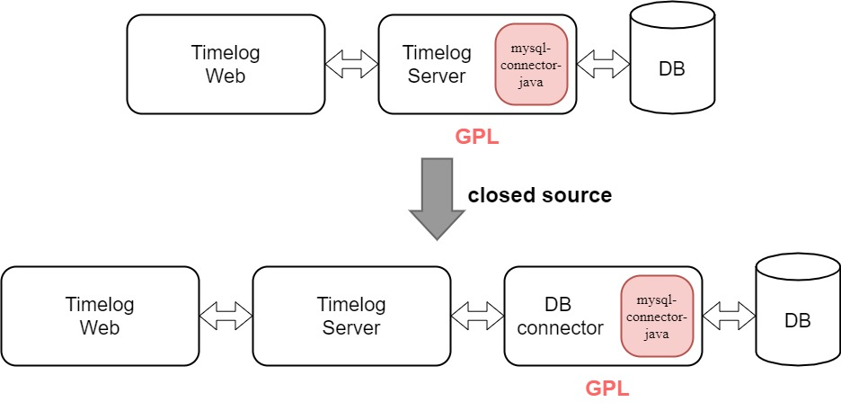
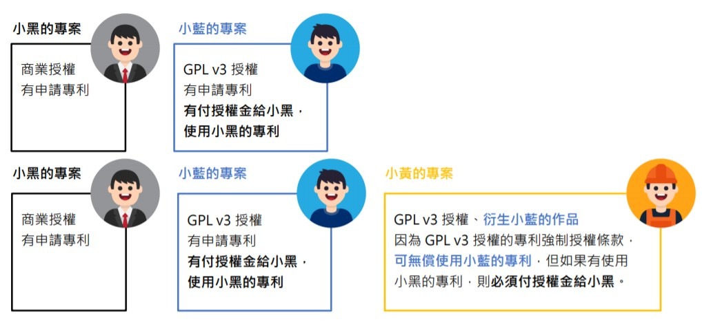

# 軟體授權選擇

- [Review](#review)
  * [授權聲明範例](#授權聲明範例)
- [開源軟體之選擇](#開源軟體之選擇)
- [Timelog的開源選擇](#timelog的開源選擇)
  * [Timelog前端所使用的套件及其授權](#timelog前端所使用的套件及其授權)
  * [Timelog後端所使用的套件及其授權](#timelog後端所使用的套件及其授權)
  * [Timelog產品開源選擇](#timelog產品開源選擇)
- [為專案加入License](#為專案加入license)
- [雙授權](#雙授權)
- [軟體專利與自由軟體](#軟體專利與自由軟體)

## Review

  
Permissive: 授權條款允許但不強制要求公開衍生作品的原始碼。  
Restrictive: 授權條款強制要求公開衍生作品的原始碼。  
Copyleft: 概念源自於自由軟體運動，並不代表放棄著作權，而是一種基於現有的著作權體制，保障其他使用者能自由使用軟體的權利。  

- MIT, Apache 2.0, BSD 散佈時需附上著作權及其授權條款，衍生作品不須開源

### 授權聲明範例  
- MIT聲明範例 [Node.js](https://github.com/nodejs/node/blob/master/LICENSE)  
	- 情境一 : 未修改 Node.js 源碼  
		單純使用Node.js所提供的功能, 未對其做修改  
		->  不需要特別聲明便可直接使用  

	- 情境二 : 修改 Node.js 源碼但未發佈，僅自行使用  
		基於Node.js修改後僅內部使用  
		->  因未發佈或銷售，所以不需要特別聲明  

	- 情境三 : 修改 Node.js 源碼並將其發佈公開  
		基於Node.js修改後發佈  
		->  產品中必須包含 Node.js 的授權聲明

- Apache 2.0 聲明範例 [hadoop](https://github.com/apache/hadoop/blob/trunk/LICENSE.txt)  

hadoop的授權聲明中，在Apache 2.0的聲明下方額外加入第三方元件所使用的license，而專案下的file內也保留了元件原本的授權聲明。

|  |
| ------ |

在hadoop目錄下的gtest-all.cc中，使用到由Google公司開發，採BSD授權的gtest.h，所以保留其著作權聲明、BSD的條款，以及免責聲明。  

|  |
| ------ |

其他範例參考 :  
MIT聲明範例 [Angular](https://github.com/angular/angular/blob/master/LICENSE)     
BSD聲明範例 [freeBSD](https://github.com/freebsd/freebsd/blob/master/COPYRIGHT)  

## 開源軟體之選擇   
- 自由開源軟體決策流程圖  
  

內部使用：API及執行檔只提供給組織內成員使用，沒有對外散布。   
原狀使用：僅使用現有的軟體程式碼。   

- 以產品開源為例  
  

- 以產品不開源為例  
  

## Timelog的開源選擇
軟體系統實驗室開發一套時間管理系統Timelog，開發過程分為前端的網站及後端的伺服器，並分別使用不同套件開發。
- 開發人員的想法/公司的政策
- 產品使用套件的授權

### Timelog前端所使用的套件及其授權
綠色代表該套件使用寬鬆(Permissive)的授權條款，紅色代表該套件使用有限制(Restrictive)的授權條款。   

### Timelog後端所使用的套件及其授權
綠色代表該套件使用寬鬆(Permissive)的授權條款，紅色代表該套件使用有限制(Restrictive)的授權條款。    

### Timelog產品開源選擇

- 當不開源Timelog時的開源軟體決策流程圖   
  

- GPL套件模組化示意圖

## 為專案加入License

1. 找尋合適的授權後複製 [Choose an open source license](https://choosealicense.com/)  

  

2. 為專案新增一個LICENSE的檔案，貼上複製下的授權條款  

  
  

3. 修改 README  
  

4. 新增成功  
  

## 雙授權

- 雙授權(Dual-licensing)軟體是指一套軟體採用兩種不同的授權，供使用者**擇一使用**。
- 願意遵循GPL條款的使用者，以自由開源軟體的授權，取得使用、修改與重新發布該軟體專案的權利。
- 不願受到GPL高度互惠限制的使用者，便可以付費購買商業授權的版本。
- Oracle MySQL
- 多授權(Multi-licensing)：Qt授權方式採用商業授權以及自由軟體授權（LGPL、GPL）

## 軟體專利與自由軟體

- 自由軟體**協同創作、自由使用、修改與重新發布**、提倡重複使用性
- 專利權**排他、尋求授權金**
- 軟體專利

  1.圈地運動亂象

  2.缺乏軟體背景的專利審查者 (Amazon 1-click)

  3.自由軟體社群在法律資源上較私有軟體公司弱勢

  4.專利可以不公開18個月　

- 自由軟體社群採取的防禦手段

  1.自己下來圈地  

  2.Novell和Microsoft簽訂互不侵犯協定→雙贏？  

  3.公眾審查制度  

  4.在自由軟體授權中增加**專利強制授權條款** (GPL v3)  

	e.g.  

	  
  5.防禦性先前技術發表  
  Open Source Software as Prior Art(OSSPA)
